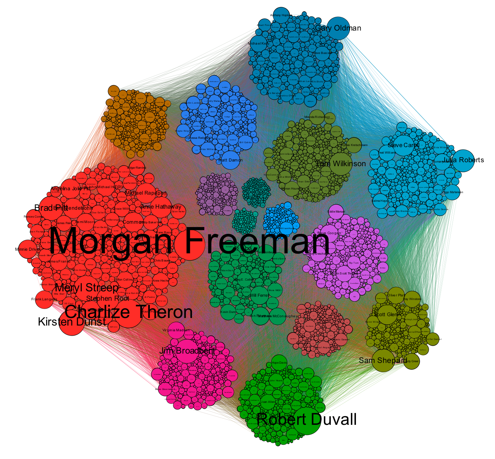
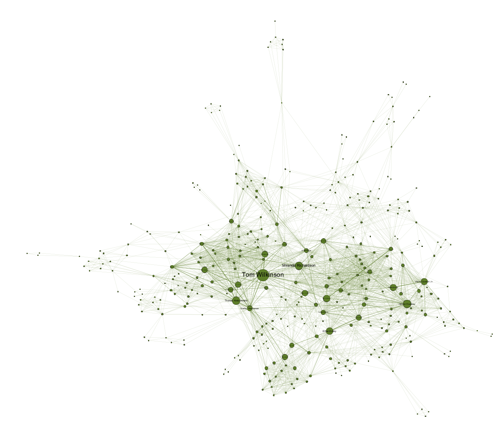
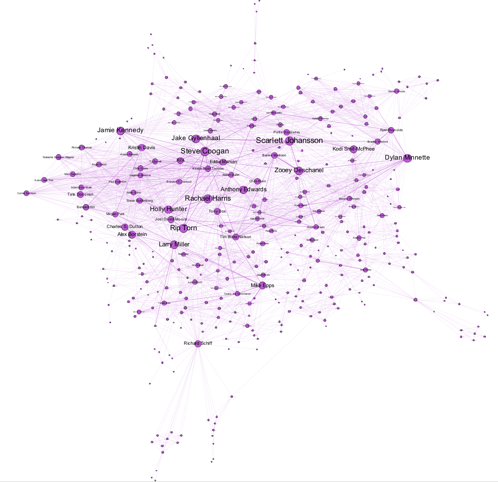
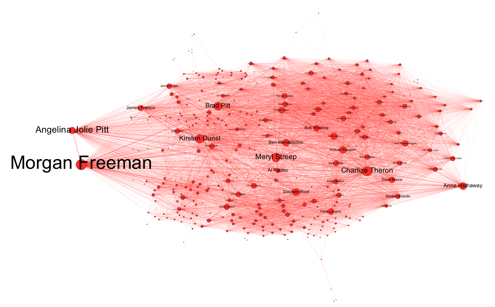

```{r setup, include=FALSE}
knitr::opts_chunk$set(echo = TRUE)
options(scipen = 999)
```

```{css, echo=FALSE}
#content {
    background: #fcfcfc;
    height: 100%;
    margin-left: 300px;
    max-width: 100% !important; 
    min-height: 100%;
}

img.image-thumb {
    width: 800px !important;
    border: 1px solid #CCC;
    padding: 2px;
}
```

# Introduction

In this report, we will be analysing a dataset from [Kaggle](https://www.kaggle.com/rounakbanik/the-movies-dataset#links.csv), which contains movies of different genres produced over a vast number of years. What makes this analysis interesting is that we can try and draw various conclusions based on a movie's popularity, directors or actors involved, year of production, and so forth. Moreover, we can construct various networks in an attempt to find meaningful and interesting results.
When inspecting a database of films from recent years, various interesting inferences are uncovered. A film may have a high rating yet low return on investment (ROI). Which genre would you guess is the most successful? Which actors do you think are the most popular? 


We have split our Exploratory Data Analysis into four main parts:

|  Section 	|                                                                                                                                                                                                                                                 	|
|---	|--------------------------------------------------------------------------------------------------------------------------------------------------------------------------------------------------------------------------------------------------------	|
| 1 	| Introducing the Data <br> - We first try to understand the data and look at its content.  |
| 2 	| Pre-Processing <br>- We look at what needs to be altered or removed from the dataset. <br>- We try clean any dirty text. <br>- We try to minimise the dataset's missing values.                                                                                    	|
| 3 	| Exploring the Data <br>- We conduct basic analysis on the dataset.  <br>- We explore genres. <br>- We explore movie popularity. <br>- We look at profit, gross, and return of interests with movies. <br>- We conduct more advanced analysis on the dataset.               	|
| 4 	| Network Analysis <br>- We measure the network (centrality, degree distribution, number of components, average degree) <br>- We use network measures to highlight certain nodes (actors) and see which measures of an actor will increase ratings and budgets.  	|                                                                                                                                  |

-----

# Admin

Before we start, let's keep this code chunk for importing the correct libraries and loading the appropriate dataset. We use pacman to load the following:

```{r message=FALSE, warning=FALSE}
pacman::p_load(rjson, jsonlite, DT,  RJSONIO, data.table, dplyr, compareDF, prettydoc, rmdformats, VIM, ggplot2, stringr, tidyr, plotly, RColorBrewer, formattable, corrplot, ggpubr, ngram, syuzhet, tm, wordcloud, sentimentr, reshape2, rlist, gplots, plsgenomics, ggrepel, GGally, rmdformats)
```

We import the dataset like this:
```{r}
movie_metadata <- read.csv("../data/real_deal.csv")
```

In the next section we introduce our dataset and look its content. 

-----

# Introducing The Dataset

This section of the report is quite essential for our analysis. We cannot make any interesting inferences from the dataset if we do not know what is contained within it. In this section we will try to understand exactly what we are dealing with. Thereafter, we can begin to draw interesting results. 

The `movie_metadata` dataset contains 28 unique columns/variables, each of which are described in the table below:

Variable Name            | Description
-------------------------|----------------------------------------------
color                    | Specifies whether a movie is in black and white or color
director_name            | Contains name of the director of a movie
num_critic_for_reviews   | Contains number of critic reviews per movie
duration                 | Contains duration of a movie in minutes
director_facebook_likes  | Contains number of facebook likes for a director
actor_3_facebook_likes   | Contains number of facebook likes for actor 3
actor_2_name             | Contains name of 2nd leading actor of a movie
actor_1_facebook_likes   | Contains number of facebook likes for actor 1 
gross                    | Contains the amount a movie grossed in USD
genres                   | Contains the sub-genres to which a movie belongs
actor_1_name             | Contains name of the actor in lead role
movie_title              | Title of the Movie
num_voted_users          | Contains number of users votes for a movie
cast_total_facebook_likes| Contains number of facebook likes for the entire cast of a movie
actor_3_name             | Contains the name of the 3rd leading actor of a movie
facenumber_in_poster     | Contains number of actors faces on a movie poster
plot_keywords            | Contains key plot words associated with a movie
movie_imdb_link          | Contains the link to the imdb movie page
num_user_for_reviews     | Contains the number of user generated reviews per movie
language                 | Contains the language of a movie
country                  | Contains the name of the country in which a movie was made
content_rating           | Contains maturity rating of a movie
budget                   | Contains the amount of money spent in production per movie
title_year               | Contains the year in which a film was released
actor_2_facebook_likes   | Contains number of facebook likes for actor 2
imdb_score               | Contains user generated rating per movie
aspect_ratio             | Contains the size of the aspect ratio of a movie
movie_facebook_likes     | Number of likes of the movie on its Facebook Page


Furthermore, the dataset contains `5043` movies, spanning across `96` years in 46 countries. There are `1693` unique director names and `5390` number of actors/actresses. Around `79%` of the movies are from the USA, `8%` from UK, and `13%` from other countries.

The structure of the dataset can also be used to understand our data. We can run the following code chunk to see its structure.

```{r}
# Get structure of dataset
str(movie_metadata)
```

In the next section we can start preparing the dataset for analysis by removing and simplifying some of the data.

-----

# Pre-Processing Data

In this part of the report we attempt to look for various things that may have a negative or significant impact on the inferences we make on the dataset. Once we have sufficiently cleaned and prepared the dataset, we can commence with drawing various conclusions from the graphs we generate. 


## Duplicate Rows

In the `movie_metadata` dataset, we can derive that their are 45 duplicated rows which needs to be removed and kept the unique ones.

```{r}
# find duplicated rows
sum(duplicated(movie_metadata))
```

```{r Remove Duplicates}
# Remove duplicated rows
movie_metadata <- movie_metadata[!duplicated(movie_metadata), ]
```

## Missing Values

Let's have a look at the number of NA values in our dataset:
```{r}
# Find NA values
colSums(sapply(movie_metadata, is.na))
```

To help visualise this, have a look at the following heatmap of the missing values:
```{r }
# Visualise Missing Values
missing.values <- aggr(movie_metadata, sortVars = T, prop = T, sortCombs = T, cex.lab = 1.5, cex.axis = .6, cex.numbers = 5, combined = F, gap = -.2)
```

## Gross and Budget

Since `gross` and `budget` have too many missing values (874 and 488), and we want to keep these two variables for the following analysis, we can only delete rows with null values for gross and budget because imputation will not do a good job here.

```{r}
# Find NA values for gross and budget
movie_metadata <- movie_metadata[!is.na(movie_metadata$gross), ]
movie_metadata <- movie_metadata[!is.na(movie_metadata$budget), ]
dim(movie_metadata)
```

The difference in observations have decreased by `4998 - 3857 = 1141` which is luckily only `22.8%` of the previous total observations.


## Content Rating

The dataset contains a vast range of content rating, which can be seen below:

```{r}
# Look at all the different types of content ratings
table(movie_metadata$content_rating)
```

We find  that `M = GP = PG, X = NC-17`, so let's replace `M` and `GP` with `PG`, and `X` with `NC-17`, because these are (apparently) what we use today.

```{r}
# Renaming content ratings 
movie_metadata$content_rating[movie_metadata$content_rating == 'M']   <- 'PG' 
movie_metadata$content_rating[movie_metadata$content_rating == 'GP']  <- 'PG' 
movie_metadata$content_rating[movie_metadata$content_rating == 'X']   <- 'NC-17' # No one under 17
```

We want to replace `Approved`, `Not Rated`, `Passed`, `Unrated` with the most common rating `R`.

```{r}
movie_metadata$content_rating[movie_metadata$content_rating == 'Approved']  <- 'R' 
movie_metadata$content_rating[movie_metadata$content_rating == 'Not Rated'] <- 'R' 
movie_metadata$content_rating[movie_metadata$content_rating == 'Passed']    <- 'R' 
movie_metadata$content_rating[movie_metadata$content_rating == 'Unrated']   <- 'R' 
movie_metadata$content_rating <- factor(movie_metadata$content_rating)
table(movie_metadata$content_rating)
```

Blank spaces should be taken as missing value. Since these missing values cannot be replaced with reasonable data, we delete these rows.

```{r}
# Remove rows with blank content ratings
movie_metadata <- movie_metadata[!(movie_metadata$content_rating %in% ""),]
```

## Delete (Some) Rows

Let’s now have a look at how many complete cases we have.

```{r}
colSums(sapply(movie_metadata, is.na))
```

We remove `aspect_ratio` because 1. it has a lot of missing values and 2. we will not be looking into the impact that it has on other data (we assume that it doesn't). 

```{r}
# Remove aspect_ratio column
movie_metadata <- subset(movie_metadata, select = -c(aspect_ratio))
```

## Add a Column

### Gross and Budget

We have gross and budget information. So let’s add two columns: `profit` and `percentage return on investment` for further analysis.

```{r}
# add profit and return of investment column
movie_metadata <- movie_metadata %>% 
  mutate(profit = gross - budget,
         return_on_investment_perc = (profit/budget)*100)
```

## Remove (Some) Columns

### Colour

Next, we take a look at the influence of `colour` vs `black and white`. 

```{r}
# Get colour display types of movies
table(movie_metadata$color)
```

Since `3.4%` of the data is in black and white, we can remove the `color` column it. 

```{r}
# remove colour column
movie_metadata <- subset(movie_metadata, select = -c(color))
```

### Language

Let's have a look at the different languages contained within the dataset.

```{r}
# Look at different languages
table(movie_metadata$language)
```

Almost `95%` movies are in English, which means this variable is nearly constant. Let’s remove it.

### Country

Next, we can look at the different types of countries.

```{r}
# Look at different countries
table(movie_metadata$country)
```

Around `79%` movies are from USA, `8%` from UK, `13%` from other countries. So we group other countries together to make this categorical variable with less levels: `USA`, `UK`, `Others`.

```{r}
# Grouping countries
levels(movie_metadata$country) <- c(levels(movie_metadata$country), "Others")
movie_metadata$country[(movie_metadata$country != 'USA')&(movie_metadata$country != 'UK')] <- 'Others' 
movie_metadata$country <- factor(movie_metadata$country)
table(movie_metadata$country)
```

Now that we've cleaned up our dataset, we can now continue to explore our data even further! In the next section we will be looking at genres, movie popularity, gross, profit, and many more other aspects pertinent to our data. 

-----

# Analysing Data

When inspecting a dataset of movies over the past few years, various interesting inferences can be uncovered. A movie may have a high rating yet low return on investment. Which genre is the most successful? Which actors are the most popular? These are some of the questions we aim to answer in this section.

We can start by performing basic analyis on our data. Thereafter, we delve a bit deeper into more specific parts of the dataset, in hopes of uncovering interesting observations.

## Basic Analysis

Let's first have a look at the number of movies that are produced over the years.

```{r}
# Plotting the number of movies released
ggplot(movie_metadata, aes(title_year)) +
  geom_bar() +
  labs(x = "Year movie was released", y = "Movie Count", title = "Number of Movies Released Per Year (1916 - 2016)") +
  theme(plot.title = element_text(hjust = 0.5)) +
  geom_vline(xintercept=c(1980), linetype="dotted") +
  ggplot2::annotate("text", label = "Year = 1980",x = 1979, y = 50, size = 3, colour = "blue", angle=90)
```

From the graph, we see there aren’t many records of movies released before 1980. It’s better to remove those records because they might not be representative of the data.

```{r}
movie_metadata <- movie_metadata[movie_metadata$title_year >= 1980,]
```

Let's have a look at the movie counts now:

```{r}
# Plotting the number of movies released since 1980
ggplot(movie_metadata, aes(title_year)) +
  geom_bar() +
  labs(x = "Year movie was released", y = "Movie Count", title = "Number of Movies Released Per Year (1980 - 2016)") +
  theme(plot.title = element_text(hjust = 0.5))
```

The graph above illustrate the number of movies released for the period 1980 - 2016. As we can see, from the 1980's a quick and exponential rise of movies released occurred.

## Movie Genre Analysis

```{r include=FALSE}
# setting up plotly label, axis and text customizations
f1 <- list(
  family = "Old Standard TT, serif",
  size = 14,
  color = "grey"
)
f2 <- list(
  family = "Old Standard TT, serif",
  size = 10,
  color = "black"
)
a <- list(
  titlefont = f1,
  showticklabels = T,
  tickangle = -45,
  tickfont = f2
)

m <- list(
  l = 50,
  r = 50,
  b = 100,
  t = 100,
  pad = 4
)

# annotations for subplot
a1 <- list(x = 0.5, y = 1.0,
          showarrow = FALSE, 
          text = "Distribution of bugdet", 
          xanchor = "center", 
          xref = "paper", 
          yanchor = "bottom", 
          yref = "paper", 
          font = f1)
  
b1 <- list(x = 0.5, y = 1.0, 
           showarrow = FALSE, 
           text = "Distribution of gross", 
           xanchor = "center", 
           xref = "paper", 
           yanchor = "bottom", 
           yref = "paper",
           font = f1)
```

Now we can delve into more specific things regarding movies, like `genres`. 

### Top Genres

```{r}
genre = movie_metadata['genres']

# Make genre a dataframe
genre = data.frame(table(genre))

# Order genres based on frequency
genre = genre[order(genre$Freq,decreasing=TRUE),]

# Top 20 genres with the most movies
ggplot(genre[1:20,], aes(x=reorder(factor(genre), Freq), y=Freq, alpha=Freq)) + 
  geom_bar(stat = "identity", fill="maroon") + 
  geom_text(aes(label=Freq),hjust=1.2, size=3.5)+
  xlab("Genre") + 
  ylab("Number of Movies") + 
  ggtitle("Top 20 Genres with the most movies") + 
  coord_flip()
```

From the above a combination of `Comedy`, `Romance`, and `Drama` appears to be, by far, the most frequent produced genres. As you can see, movies have multiple genres that they are associated with. For analysis purposes, we choose to use the first word in the genre column, as this is likely to be the most accurate description of the movie.

### Split Genres

Here we first split the genres into multiple columns and merge them together.

```{r}
head(movie_metadata$genres)
```

Let's split the genres separated by "|" into 8 different columns.

```{r fig.height=5, fig.width=11, message=FALSE, warning=FALSE}
# Split on "|"
genres_split <- str_split(movie_metadata$genres, pattern="[|]", n=2)

# Create Matrix
genres_matrix <- do.call(rbind, strsplit(movie_metadata$genres, '[|]'))

# Dataframe of genres
genres_df <- as.data.frame(genres_matrix)
```

`genre_df` consists of 8 columns, each with different genres. Let's have a look at the frequency of ALL the genres. 


```{r}
# Collapse all genres into one column
genres_one_col <- gather(genres_df) %>% 
  select(value)

# Top 30
top30 <- genres_one_col %>%
  group_by(value) %>% 
  tally() %>% 
  filter(n >= 30)

# Plot frequency of first column
top30 %>% 
  ggplot(aes(x=reorder(factor(value), n), y=n, alpha=n)) +
  geom_bar(stat="identity", fill="maroon") +
  geom_text(aes(label=n),hjust=1.2, size=3.5) +
  theme(axis.text.x = element_text(angle = 90, hjust = 1)) +
  xlab("Genre") +
  ylab("Frequency") +
  ggtitle("Movie Genre Frequency") +
  coord_flip()
```

It is evident that the `Drama` and `Comedy` genre are still the most popular to be produced. It is also interesting to note that `Romance` is fairly lower on the list as in the previous graph. This may imply that most movies predominantly co-occur with `Comedy` or `Drama`. `Romance` movies do not co-occur with any of the other genres as frequently as `Comedy` and `Drama` do. Additionally, the fact that `Comedy` and `Drama` occurs the most does not necessarily mean that they are the most profitable, returning successful ROI’s. We will try and explore this later on in the report.

Previously we assumed that the first genre is the most applicable, therefore, we choose the first column as the genre for the movie and append it to the dataframe. 

```{r}
# Remove old genre column
movie_metadata <- subset(movie_metadata, select = -c(genres))

# Take first column of genres_df and add it to MAIN df
movie_metadata$genre <- genres_df$V1
```

How does this distribution look like over the years? Lets have a look at the frequency of genres between the period of 1980 and 2016.

```{r}
# Plotting the movie genres produced
movie_metadata %>%
 group_by(title_year, genre) %>%
 summarise(count = n()) %>%
 ggplot(aes(title_year, as.factor(genre))) +
 geom_tile(aes(fill=count),colour="white") +
 scale_fill_gradient(low="light blue",high = "dark blue") +
 xlab("Year of Movie") +
 ylab("Genre of Movie") +
 ggtitle("Heat Map of Movie Genres Produced Over the Years") +
  theme(panel.background = element_blank())
```

We can make one or two remarks from this heatmap: Firstly, we can see that `Action`, `Adventure`,`Comedy`, and `Drama` are genres that are predominantly used as the first term to associate with a movie. Secondly, we can see that `Romance`, which was previously high in frequency for co-occurring with `Comedy` and `Drama` is now very low. This means that there are very few movies that are predominantly `Romance`, meaning `Romance` is mostly the second, third, etc term to describe a movie.

Additionally, we can also see that some genres, like `Action` and `Comedy` have picked up over the years. This is evident by looking at the darker shades of blue becoming more prominent in the latter years. 

### Which Genres are Popular?

In our dataset we have Facebook Likes and IMDB scores associated with a movie. This can help give us an indication of how popular each genre is. There are different types of Facebook likes within the dataset, namely `director_facebook_likes`, `actor_3_facebook_likes`, `actor_1_facebook_likes`, `cast_total_facebook_likes`, `actor_2_facebook_likes`, and finally `movie_facebook_likes`. Let's add them all together for each movie. 

```{r}
# Add column for total facebook likes
movie_metadata$total_facebook_likes <- movie_metadata$director_facebook_likes + 
  movie_metadata$actor_3_facebook_likes + movie_metadata$actor_1_facebook_likes +
  movie_metadata$cast_total_facebook_likes + movie_metadata$actor_2_facebook_likes + 
  movie_metadata$movie_facebook_likes
```

```{r include=FALSE}
movie_metadata <- movie_metadata[!is.na(movie_metadata$total_facebook_likes), ]
```

Now let's calculate the average IMDB score, average user votes, average Facebook likes and average number of reviewers for each genre.

```{r, fig.height = 4, fig.width = 6, }
# creating a data frame containing avg score, avg votes and avg fb likes
score_votes_likes <- movie_metadata %>% 
  group_by(genre) %>%
  summarise(count = n(),
            avg_score = round(mean(imdb_score), 1),
            avg_votes = mean(num_voted_users),
            avg_facebook_likes = mean(total_facebook_likes),
            avg_reviews = mean(num_user_for_reviews)) %>%
  filter(count > 10)

# arranging data frame by average score
arr_score <- arrange(score_votes_likes, desc(avg_facebook_likes))

# Show data frame
as.data.frame(score_votes_likes)
```

The most liked genres on Facebook is `Biography` (41000.900), `Adventure` (40494.340), and `Action` (38762.692). The most popular genres, based on IMDB scores, are `Biography` (7.9), `Crime` (6.9), `Documentary` (6.8), and `Drama` (6.8). It may be interesting to note that previously we saw that `Comedy` and `Drama` are produced the most frequently overall - yet it seems like the public scores `Biography`, `Crime`, `Documentary`, and `Drama` movies consistently high. This may also imply that there could be a vast range in scores for `Comedy` and `Drama`, justifying a fairly lower score than the rest. Furthermore, `Comedy`, `Action`, `Drama` have a very high number of voters - which may account for the lower overall average.


## Popularity Analysis

#### IMDB ratings VS Movie Count

Let's have a look at the IMDB rating distribution on the number of movies that are produced. Below we can see that the data is slightly skewed to the left. We have a concentration of data among 6 out of 10 and a long tail to the left. The vast majority of the movies are given a score between 5 and 7.5, with fewer movies scoring higher than that.

```{r message=FALSE, warning=FALSE}
# Plotting the IMDB ratings vs movie count
ggplot(movie_metadata, aes(imdb_score)) +
  geom_histogram(bins = 50) +
  geom_vline(xintercept = mean(movie_metadata$imdb_score,na.rm = TRUE),colour = "blue") +
  ylab("Movie Count") +
  xlab("IMDB Rating") +
  scale_x_continuous(limits = c(0, 10)) +
  ggtitle("IMDB Ratings for Movies") +
  ggplot2::annotate("text", label = "Mean IMDB rating",x = 6.2, y = 50, size = 3, colour = "yellow",angle=90)
```

The lowest scored movie, titled `Justin Bieber: Never Say Never`, is `1.6` whereas the highest score is `9.3` for `The Shawshank Redemption`. The mean of the imdb scores is `6.433288`.

```{r eval=FALSE, include=FALSE}
imdb_score <- movie_metadata$imdb_score
max(imdb_score)
min(imdb_score)
mean(imdb_score)
```

#### Popularity over the years

Let's take a look at when Facebook started. From the graph it is clear that the number of Facebook likes for movies released post 2004 have increased dramatically. Old movies receive fewer likes, which is most likely due to Facebook marketing newer movies.

```{r message=FALSE, }
#Creating the required subset of data 
movies_pop <- movie_metadata %>%
 select(title_year, movie_facebook_likes) %>%
 filter(title_year > 1980) %>%
 group_by(title_year) %>%
 summarise(avg = mean(movie_facebook_likes)) 

#Generating the popularity vs time plot
 ggplot(movies_pop, aes(x = title_year, y = avg)) +
   geom_point() +
   geom_smooth() + 
   geom_vline(xintercept = c(2004),colour = c("blue")) +
   ylab("Average Facebook Likes") +
   xlab("Years Movie Was Produced") +
   ggplot2::annotate("text", label = "Facebook",x = 2003.5, y = 10000, size = 3, colour = "blue",angle=90)
```

### Facebook Likes VS IMDB Score
```{r}
# Plotting the Facebook Likes VS IMDB Score
movie_metadata %>% 
  group_by(content_rating) %>% 
  summarise(avg_fb_likes = mean(movie_facebook_likes), avg_imdb_score = mean(imdb_score), num=n()) %>% 
  ggplot() +
    geom_point(aes(x=avg_fb_likes, y=avg_imdb_score, color=content_rating, size=num), stat="identity") + 
  scale_y_continuous(limits = c(0, 10)) +
  xlab("Average Facebook Likes") +
  ylab("Average imdb score")
```

There are three things to look at with this graph: Average IMDB score, average Facebook likes and the number of movies rated per content-rating. We can see that all movies have (on average) very similar IMDB scores, however, they differ higly on the number of Facebook likes. For example, movies rated `PG-13` receive much more Facebook likes (on average) than movies rated `NC-17`. Movies rated `R` receive (on average) more likes than movies rated `NC-17`, but still have relatively similar IMDB scores. 


### IMDB Scores VS Facebook Likes

We can infer a strong correlation between a movie's Facebook likes and its IMDB Score. This is expected, as a higher individual rating relates to higher viewer satisfaction; and hence it is expected to see an increase in positive online presence. Initially, this graph was constructed to see if there'd be a difference between viewer enjoyment and movie rating. Movie databases are often critisized for the nature of their rating scales, made by critics and placing priority on sentiments and plot, which may not fully coincide with viewer enjoyment. However, as seen below, this is not the case using IMDB's Scoring.

```{r message=FALSE, warning=FALSE}
#Plotting Facebook likes against IMDB score
ggplot(data = movie_metadata, aes(x = imdb_score, y = movie_facebook_likes)) +
  scale_x_continuous(limits = c(0, 10)) +
  geom_smooth()
```

### Top 20 directors with highest average IMDB score

Let's take a look at the directors. We can see that the top IMDB rated directors have very similar scores (8.1 - 8.6). `Tony Kaye` has the highest rating of 8.6.

```{r}
# Displaying the avg_imdb score of directors
movie_metadata %>%
  group_by(director_name) %>%
  summarise(avg_imdb = mean(imdb_score)) %>%
  arrange(desc(avg_imdb)) %>%
  top_n(20, avg_imdb) %>%
  formattable(list(avg_imdb = color_bar("orange")), align = 'l')
```

### Vote Counts

The IMDB rating system was first implemented in the 1990's. Social media platforms like Facebook had started in the mid 2000’s. It is evident that Facebook influenced the number of rates per movie far higher than that of IMDB.

```{r}
#Performing operations on Movies Vote Count over the years
 movies_vote1 <- movie_metadata %>%
  select(title_year, num_voted_users) %>%
  group_by(title_year) %>%
  summarise(count = sum(num_voted_users)) 

 ggplot(movies_vote1, aes(x = title_year, y = count/1000)) +
   geom_bar( stat = "identity") +
   geom_vline(xintercept = c(1990,2004),colour = c("orange","blue")) +
   ylab("Vote count (in thousands)") +
   xlab("Years") +
   ggplot2::annotate("text", label = "Facebook",x = 2003, y = 21000, size = 3, colour = "blue",angle=90) + 
   ggplot2::annotate("text", label = "IMDB",x = 1989, y = 21000, size = 3, colour = "orange",angle=90)
```

### Vote Counts VS IMDB score

```{r echo=T}
# breaking num_users_voted into 4 buckets 
movie_metadata$vote_bucket <- cut(movie_metadata$num_voted_users, 
                         c(0, 50000, 100000, 300000, 500000))
```


```{r  fig.height = 4, fig.width = 6, }
# plotting a boxplot for votes vs imdb_score  
bp <- na.omit(movie_metadata) %>% 
  ggplot(aes(x = vote_bucket, y = imdb_score)) +
  geom_boxplot(aes(fill = vote_bucket), alpha = 0.7,
               show.legend = F) +
  stat_summary(fun.y = mean, geom = "point",
               shape = 23) +
  coord_flip() +
  xlab("User Votes") +
  ylab("IMDB Score") +
  ggtitle("Box plot for User Votes vs IMDB Score") +
  theme_minimal() +
  theme(plot.title = element_text(size = 14, 
                                  color = "darkgrey",
                                  family = "Times"))
ggplotly(bp) %>%
  layout(margin = m, 
        xaxis = a, 
        yaxis = a,
        legend = list(orientation = "h", size = 4,
                       bgcolor = "#E2E2E2",
                       bordercolor = "darkgrey",
                       borderwidth = 1,
                       x = 0,
                       y = -0.3)) 
```

```{r warning=FALSE, include=FALSE, fig.height = 4, fig.width = 6,}
# creating a function called scatter_plot for
# plotting scatter plots using ggplot and plotly

scatter_plot <- function(x, y, xlabel, ylabel, title,
                         text1, text2, text3,
                         alpha = NULL){
  if(is.null(alpha)) alpha <- 0.4
  gp <- ggplot(data = movie_metadata, mapping = aes(x = x, y = y,
                                          text = paste(text1, x,
                                                       text2, y,
                                                       text3, movie_title)))
  plot <- gp + geom_point(position = "jitter", 
                          show.legend = F, shape = 21, 
                          stroke = .2, alpha = alpha) + 
    xlab(xlabel) +
    ylab(ylabel) +
    ggtitle(title) +
    theme_minimal() +
    theme(legend.position = "none",
          plot.title = element_text(size = 12, face = "bold", 
                                    family = "Times", 
                                    color = "darkgrey")) 
  
  ggplotly(plot, tooltip = "text") %>%
    layout(m, xaxis = a, yaxis = a)
}
```


```{r fig.height = 4, fig.width = 6, }
# scatter plot for user votes vs imdb score
scatter_plot(movie_metadata$num_voted_users, movie_metadata$imdb_score, 
     "User Votes",
     "IMDB Score",
     "Scatter plot for User Votes vs IMDB Score",
     "User Votes:",
     "<br>IMDB Score:",
     "<br>Title:",
     alpha = 0.3)
```
From the above scatter plot, it is evident that the majority of the movie ratings are clustered at 7.5 points.

Average score, avg votes and, avg user reviews

```{r message=FALSE, warning=FALSE, include=FALSE}
# creating a function for plotting plotly line graph for title_year
line_graph <- function(data, y, name){
 
  scat_p1 <- plot_ly(data, x = ~title_year, y = ~ y, 
             name = name, type = 'scatter', mode = 'lines',
             line = list(color = sample(brewer.pal(11, "Spectral"), 1))) %>%
  layout(xaxis = list(title = "Title Year", zeroline = F,
                      showline = F, 
                      showticklabels = T),
         yaxis = list(title = "Average Score"),
         title = "Line Graph for Avg Score/Avg Votes/Avg User Review by Title Year", 
         font = list(family = "Serif", color = "grey"),
         legend = list(orientation = "h", size = 6,
                       bgcolor = "#E2E2E2",
                       bordercolor = "darkgrey",
                       borderwidth = 1),
         margin = m)
  scat_p1
}
```


Each line represents an average, for the imdb score, votes and user review. 
```{r fig.height = 6, fig.width = 10, }
# creating a data frame for average score, avg votes and, avg user reviews
# by title year
scat_year_score <- movie_metadata %>%
  group_by(title_year) %>%
  summarise(count = n(),
            IMDB_Score = round(mean(imdb_score),1),
            avg_votes = mean(num_voted_users),
            avg_user_review = round(mean(num_user_for_reviews)))

# plotting line graph for Avg score by title year 
lp1 <- line_graph(scat_year_score, 
                  scat_year_score$IMDB_Score, 
                  "Average Score")

# plotting line graph for Avg votes by title year
lp2 <- line_graph(scat_year_score, 
                  scat_year_score$avg_votes, 
                  "Average Votes")

# plotting line graph for Avg reviews by title year
lp3 <- line_graph(scat_year_score,
                  scat_year_score$avg_user_review,
                  "Average User Review") 


subplot(lp1, lp2, lp3, nrows = 3, heights = c(0.33, 0.33, 0.33))

```


## Profit | Gross | Return of Interest

```{r}
# Plotting movie budget and gross
budget <- movie_metadata %>%
  select(movie_title, budget) %>%
  arrange(desc(budget)) %>%
  head(15)

x <- ggplot(budget, aes(x = reorder(movie_title, -desc(budget)), y = budget/1000000)) +
  geom_bar( stat = "identity")+ 
  theme(axis.text.x=element_text(hjust=1))+
  ggtitle("Movie Budgets")+
  xlab("")+
  ylab("Budget (in Millions)") + 
  coord_flip()

rev <- movie_metadata %>%
  select(movie_title, gross) %>%
  arrange(desc(gross)) %>%
  head(15)

y <- ggplot(rev, aes(x = (reorder(movie_title, -desc(gross))), y = gross/1000000)) +
  geom_bar( stat = "identity")+ 
  theme(axis.text.x=element_text(hjust=1))+
  ggtitle("Movie Gross")+
  xlab("")+
  ylab("Gross (in Millions)") + 
  coord_flip() 

ggarrange(x, y,
          labels = c("A", "B"),
          ncol = 1, nrow = 2)
```

In the above graph, it is evident that the movies with with higher budgets do not essentially mean that they will equate to a high gross profit. 

Most Successful Directors based on Profit
```{r}
#Top 20 most successful directors
movie_metadata %>%
        group_by(director_name) %>%
  mutate(profit = gross - budget)%>%
select(director_name, budget, gross, profit) %>%
na.omit() %>% 
summarise(films = n(), budget = sum(as.numeric(budget)), gross = sum(as.numeric(gross)), profit = sum(as.numeric(profit))) %>%
mutate(avg_per_film = profit/films) %>%
arrange(desc(avg_per_film)) %>% 
top_n(20, avg_per_film) %>%
ggplot( aes(x = films, y = avg_per_film/1000000)) + 
geom_point(size = 1, color = "blue") + 
geom_text_repel(aes(label = director_name), size = 3, color = "blue") + 
xlab("Number of Films") + ylab("Avg Profit $millions") + 
ggtitle("Most Successful Directors")
```

Looking at the most succesful directors, one can determine that the most successful director produced only one movie (Tim Miller) or creating an array of succesful films with large budgets, such as James Cameron. 

Top 20 movies based on its Profit

```{r }
#Top 20 movies based on its Profit
movie_metadata %>% 
  filter(title_year %in% c(2000:2016)) %>%
  mutate(profit = gross - budget,
         return_on_investment_perc = (profit/budget)*100) %>%
  arrange(desc(profit)) %>% 
  top_n(20, profit) %>%
  ggplot(aes(x=budget/1000000, y=profit/1000000)) + 
  geom_point(size = 2) + 
  geom_smooth(size = 1) + 
  geom_text_repel(aes(label = movie_title), size = 3) + 
  xlab("Budget $million") + 
  ylab("Profit $million") + 
  ggtitle("20 Most Profitable Movies")
```

When assessing the top 20 movies based on profit, Avatar has the highest profit margin, regioning in a similar area to director James cameron.

```{r}
#Top genres based on its Profit
movie_metadata %>% 
  filter(title_year %in% c(2000:2016)) %>%
  mutate(profit = gross - budget,
         return_on_investment_perc = (profit/budget)*100) %>%
  group_by(genre)%>%
  na.omit() %>% 
  summarise(av_profit = mean(profit), av_budget = mean(budget)) %>%
  arrange(desc(av_profit)) %>% 
  ggplot(aes(x=av_budget/10000, y=av_profit/10000)) + 
  geom_jitter(size = 2) + 
  geom_smooth(size = 1) + 
  geom_text_repel(aes(label = genre), size = 3) + 
  xlab("Budget $million") + 
  ylab("Profit $million") + 
  ggtitle("Average Return for each Genre")
```

As we can see from the above graph, even though comedy and drama are the most popular to be produced, they, overall, are not profitable. The budgets from western and thriller movies are far smaller than that of other genres. 

Top 20 movies based on its Return on Investment

```{r}
#Top 20 movies based on its Return on Investment
movie_metadata %>% 
  filter(budget >100000) %>%
  mutate(profit = gross - budget,
         return_on_investment_perc = (profit/budget)*100) %>%
  arrange(desc(profit)) %>% 
  top_n(20, profit) %>%
  ggplot(aes(x=budget/1000000, y=return_on_investment_perc)) + 
  geom_point(size = 2) + 
  geom_smooth(size = 1) + 
  geom_text_repel(aes(label = movie_title), size = 3) + 
  xlab("Budget $million") + 
  ylab("Percent Return on Investment") + 
  ggtitle("20 Most Profitable Movies based on its Return on Investment")
```
Sucessful directors such as George Lucas also have profitable movies. 

# Further Analysis

## Commercial success Vs Critical acclaim

```{r}
# Plotting of the commercial success vs critical accliam
movie_metadata %>%
  top_n(15, profit) %>%
  ggplot(aes(x = imdb_score, y = gross/10^6, size = profit/10^6, color = content_rating)) + 
  geom_point() + 
  geom_hline(aes(yintercept = 600)) + 
  geom_vline(aes(xintercept = 7.75)) + 
  geom_text_repel(aes(label = movie_title), size = 4) +
  xlab("Imdb score") + 
  ylab("Gross money earned in million dollars") + 
  ggtitle("Commercial success Vs Critical acclaim") +
  ggplot2::annotate("text", x = 8.5, y = 700, label = "High ratings \n & High gross") +
  theme(plot.title = element_text(hjust = 0.5))
```

In the above graph we can compare content rating to the content rating inference as well as the higher grossing films with sucessful directors. 

### The top 20 most popular key word

```{r message=FALSE, warning=FALSE}
# Plotting the 20 most popular keywords
movie_metadata %>%
  filter(imdb_score >6 ) %>% #Filter to show the graph only for vote_average values greater than 6
  na.omit() %>% 
  ggplot(aes(x = gross/1000000, y = content_rating), height=0) + 
  geom_jitter(alpha = 0.5, col = "darkgreen") + 
  theme(axis.text.x=element_text(angle = 90, hjust = 1))+
  ggtitle("Gross vs Content Rating") +
  xlab("Gross (millions)") +
  ylab("Rating") +
  geom_smooth() +
  coord_flip()
```


## Correlation Heatmap

```{r}
# Plotting the heatmap
ggcorr(movie_metadata, label = TRUE, label_round = 2, label_size = 2.8, size = 2, hjust = .85) +
  ggtitle("Correlation Heatmap") +
  theme(plot.title = element_text(hjust = 0.5))
```

Based on the heatmap, we can see some high correlations (greater than 0.7) between predictors.

According to the highest correlation value 0.95, we find actor_1_facebook_likes is highly correlated with the cast_total_facebook_likes, and both actor2 and actor3 are also somehow correlated to the total. So we want to modify them into two variables: actor_1_facebook_likes and other_actors_facebook_likes.

There are high correlations among num_voted_users, num_user_for_reviews and num_critic_for_reviews.

# Sentiment Analysis

```{r include=FALSE}
options(scipen = 999)
```

```{r include=FALSE}
IMDB <- read.csv("../data/real_deal.csv")

#Removing Duplicates
IMDB <- IMDB[!duplicated(IMDB), ]

#Removing White-Spaces and Special Characters
IMDB$movie_title <- gsub("Â", "", as.character(factor(IMDB$movie_title)))
IMDB$movie_title <- str_trim(IMDB$movie_title, side = "right")

IMDB <- subset(IMDB, select = -c(genres))

colSums(sapply(IMDB, is.na))
```

```{r eval=FALSE}
IMDB <- movie_metadata
```

## Exploration into Movie Plot Keywords

Keywords from movie plot lines are given in a single column, split by a "|". The following code will seperate these words into seperate columns.
```{r warning=FALSE}
#Constructing Top 20
keywords_split <- str_split(IMDB$plot_keywords, pattern="[|]", n=5)

keywords_matrix <- do.call(rbind, strsplit(as.character(IMDB$plot_keywords), "[|]"))

keywords_df <- as.data.frame(keywords_matrix)

names(keywords_df) <- c("one", "two", "three", "four", "five")

keywords_one_col <- gather(keywords_df) %>% 
  select(value)

keywords_one_col_freq <- keywords_one_col %>%
  group_by(value) %>%
  tally()

top_20 <- keywords_one_col_freq %>%
  select(value, n) %>%
  top_n(20)


movies_with_keywords <- data.frame()
IMDB_keyword_movie <- data.frame()
```

```{r }
keywords_one_col %>%
  group_by(value) %>% 
  tally() %>% 
  filter(n > 30) %>% 
  ggplot() +
  geom_bar(aes(x = value, y=n), stat="identity") +
  theme_bw() +
  theme(axis.text.x = element_text(angle = 90, hjust = 1)) +
  xlab("Keyword") +
  ylab("Frequency") +
  ggtitle("Frequency of common keywords")
```
<br>
Above we can see the most popular keywords describing the films in the dataset. 


The following code checks to see which movies contain common keywords.
```{r}
#Placing Top 20 Words Against Movie Success

IMDB_true_false <- IMDB 
for (keyword in top_20$value) {
  IMDB_true_false <- cbind(IMDB_true_false, ifelse(str_detect(IMDB$plot_keywords, keyword), "TRUE", "FALSE"))
}

for (i in 1:20) {
  reference <- 27
  names(IMDB_true_false)[reference + i] <- top_20$value[i]  
}

does_contain_common_key <- data.frame()
for (keyword in top_20$value) {
  does_contain_common_key <- rbind(does_contain_common_key, IMDB_true_false %>%
                            filter(get(keyword) == TRUE) %>% select(movie_title, gross, imdb_score, movie_facebook_likes, plot_keywords)) %>%
    distinct(movie_title, .keep_all = T)
}

does_not_contain_common_key <- data.frame()
for (keyword in top_20$value) {
  does_not_contain_common_key <- rbind(does_not_contain_common_key, IMDB_true_false %>%
                            filter(get(keyword) == FALSE) %>% select(movie_title, gross, imdb_score, movie_facebook_likes, plot_keywords)) %>%
    distinct(movie_title, .keep_all = T)
}
```


```{r}
head(does_contain_common_key %>% select(movie_title, plot_keywords) %>% sample_n(2)) 
```
<br>
Here are two movies that contain at least one common plot keyword.

```{r}
head(does_not_contain_common_key %>% select(movie_title, plot_keywords) %>% sample_n(2), 2) 
```
Here are two movies that do not contain any of the common plot key words.


```{r}
does_contain_common_key <- does_contain_common_key %>%
  mutate(tri = "Top 20 Word")

does_not_contain_common_key <- does_not_contain_common_key %>%
  mutate(tri = "NOT Top 20 Word")

all_movies_keywords_indicated <- full_join(does_not_contain_common_key, does_contain_common_key, by = c("movie_title", "gross", "imdb_score", "movie_facebook_likes", "plot_keywords"))

all_movies_keywords_indicated <- all_movies_keywords_indicated %>%
  mutate(type = coalesce(tri.y, tri.x)) %>%
  select(movie_title, gross, imdb_score, movie_facebook_likes, plot_keywords, type)

all_movies_keywords_indicated <-  all_movies_keywords_indicated %>%
  group_by(type) %>%
  na.omit() %>%
  mutate(avg_gross = mean(gross))

```

```{r}
options(scipen = 999)
```

```{r}
summarise(all_movies_keywords_indicated, avg_gross = mean(gross)) %>%
  ggplot() +
  geom_bar(aes(x = type, y=avg_gross, fill=type), stat="identity", position="stack") +
  theme(axis.text.x = element_blank()) +
  xlab("Type of movie") +
  ylab("Average Gross")
```
<br>
This graph is comparing the average gross of a movie that contains at least one keyword from the list of top 20 most common plot keyword and movies that contain none of these popular keywords.

The average gross for movies that do not contain one of the top 20 most common keywords appear to be higher.

## Sentiment pre-processing

The split keywords are needed in order to perform sentiment.
```{r}
keywords_from_split <- data.frame(lapply(keywords_split, "length<-", max(lengths(keywords_split))))
```

```{r include=FALSE}
titles <-  IMDB %>%
  select(movie_title)
years <- IMDB %>%
  select(title_year)

titles_years_list <- list()

for (x in 1:4998) {
  seperator="|"
  titles_years_list <- c(titles_years_list, paste(titles$movie_title[x], years$title_year[x], sep="|"))
}
```

```{r include=FALSE}
#Renaming columns to movie names
movie_name_list <- IMDB$movie_title
names(keywords_from_split) <- titles_years_list
```

```{r include=FALSE}
#Adding column to the begining
key_names <- c('key_word_1', 'key_word_2', 'key_word_3', 'key_word_4', 'key_word_5')
keywords_from_split <- cbind(test_keys = key_names, keywords_from_split)
```

```{r include=FALSE}
#Moving columns to rows
keywords_from_split <- melt(keywords_from_split, id = "test_keys")
```

```{r include=FALSE}
#Creating new column for year
keywords_from_split_matrix <- do.call(rbind, strsplit(as.character(keywords_from_split$variable), "[|]"))
keywords_from_split <- cbind(keywords_from_split, keywords_from_split_matrix)
names(keywords_from_split) <- c("Key #", "Combined", "Keyword", "Title", "Year")
keywords_from_split = keywords_from_split %>%
  select(`Key #`, Title, Year, Keyword)
```

```{r include=FALSE}
#Replacing blank cells within keywords to NA's
keywords_from_split$Keyword[keywords_from_split$Keyword == ""] <- NA
```

```{r include=FALSE}
#Removing rows containing NA's
keywords_from_split <- na.omit(keywords_from_split)
```

```{r inlcude=FALSE}
#All unique years
all_years <- keywords_from_split %>% select(Year)
all_years <- distinct(all_years)
all_years <- na.omit(all_years)
all_years <- all_years %>%
  filter(Year != "NA")

```

## Calculating Sentiment

Below is where the sentiment of keywords is calculated. The sentiment function used comes from the `syuzhet` package and it can detect the presence of eight different emotions, namely "anger", "anticipation", "disgust", "fear", "joy", "sadness", "surprise" and, "trust". It is also able to calculate positive and negative valence. 
```{r}
#Function for sentiment per year
yearly_sentiment <- function(year, df) {
  amount <- nrow(df %>%
    select(Year) %>%
    filter(Year == year))
  df <- df %>%
    filter(Year == year)
  sentiments <- get_nrc_sentiment(as.character(df[4]))
  for (i in 1:length(sentiments)) {
    sentiments[i] <- sentiments[i]/amount
  }
  year_sentiment <- cbind(year, sentiments)
  return (year_sentiment)
}
```

```{r}
sentiments <- data.frame()

#For-loop to capture all years
for (i in all_years$Year) {
  sentiments <- rbind(sentiments,yearly_sentiment(i, keywords_from_split))
}
```

### Sentiment results

```{r}
#Making years integers
sentiments$year <- strtoi(sentiments$year)
```

As previously mentioned, thre number of movies dramatically increases from 1980 onwards so the calculated sentiments are filtered to reduce sensitivity of the data.
```{r}
#Sort by year
sentiments_emotions <- sentiments[with(sentiments, order(year)), ] %>% 
  filter(year >= 1980) %>% 
  select(-positive, -negative)
```

```{r warning=FALSE}
#Heatmap for sentiments
rnames <- sentiments_emotions[,1]
mat_sentiments <- data.matrix(sentiments_emotions[,2:ncol(sentiments_emotions)])
rownames(mat_sentiments) <- rnames
mat_sentiments <- t(mat_sentiments)

df_sentiment <-  as.data.frame(mat_sentiments)
names_emotions <- c("anger", "anticipation", "disgust","fear","joy","sadness","surprise","trust")

sentiments_graph <- cbind(names_emotions, df_sentiment)
```


```{r warning=FALSE}
#Heatmap
heatmap.2(mat_sentiments, Rowv=NA, Colv=NA, scale="row", col=colorRampPalette(c("white","darkblue")),  margins=c(5,10), trace = "none") 
```
<br>
What is immeadiately visible is the differences in type of emotions in plot keywords has reduced over the years. The movies 


Below the trend of positive and negative sentiment is explored.
```{r}
#Filtering sentiments graph
sentiments_filter <- sentiments %>%
  filter(year >= 1980)
```

```{r}
sentiments_filter %>% 
  ggplot(aes(x = year)) +
  geom_line(aes(y = negative, color = 'postive')) +
  geom_line(aes(y = positive, color = 'negative')) + 
  ylab("Sentiment score") +
  xlab("Year") +
  ggtitle("Positive and negative sentiment of keywords across the years")
```
<br>
Generally speaking, the sentiment of common keywords used has been more positive, but has remained relatively constant, apart from the decrease in both positive and negative sentiment from around 1995 to 2010.

-----

# Network Analysis


```{r}
pacman::p_load(stringr,ggplot2, tidyr, ngram, dplyr, igraph, ggraph, visNetwork, tidygraph, graphlayouts,ggpubr, ggrepel, ggridges, viridis, network, reshape, tidytext)
setwd(getwd())
options(scipen = 999)
```

```{r}
##read in data
imdb = read.csv("../data-raw/movie_metadata.csv", sep=";")
```

### Constructing the network graph

Actors will be the nodes. Edges exist only if the actors have appeared in a movie together.

```{r}
##extract the actors
actors <- imdb %>%
  select(actor_1_name, actor_2_name, actor_3_name) 
head(actors, 5)

actors <- actors %>% 
  filter(actor_1_name != "") %>% 
  filter(actor_2_name != "") %>% 
  filter(actor_3_name != "") 
```

The nodelist will only contain each actor's name once.
```{r}
##make the nodelist
actor_nodes <- actors %>% 
  gather() %>% 
  select(value) %>% 
  distinct(value)

head(actor_nodes, 5)
```
Because each movie has three top actors given, some column manipulation is needed to format the data into the two "to" and "from" columns required for the edgelist.
```{r}
##make the edgelist for actor_1 and actor_2
temp_edges_1_2 <- actors %>% 
  select(actor_1_name, actor_2_name) %>% 
  na.omit() %>% 
  dplyr::rename(from = actor_1_name, to = actor_2_name) 

temp_edges_1_2[temp_edges_1_2==""] <- NA
temp_edges_1_2[temp_edges_1_2==" "] <- NA

temp_edges_1_2 <- temp_edges_1_2 %>% 
  na.omit()

head(temp_edges_1_2, 5)
```

```{r}
## edgelist for actor_1 and actor_3
temp_edges_1_3 <- actors %>% 
  select(actor_1_name, actor_3_name) %>% 
  na.omit() %>% 
  dplyr::rename(from = actor_1_name) %>% 
  dplyr::rename(to = actor_3_name)

temp_edges_1_3[temp_edges_1_3==""] <- NA
temp_edges_1_3[temp_edges_1_3==" "] <- NA

##remove both values if there is even one NA present, eg Tom Hardy -> NA
temp_edges_1_3 <- temp_edges_1_3%>% 
  na.omit()

head(temp_edges_1_3, 5)
```

```{r}
## edgelist for actor_2 and actor_3
temp_edges_2_3 <- actors %>% 
  select(actor_2_name, actor_3_name) %>% 
  na.omit() %>% 
  dplyr::rename(from = actor_2_name) %>% 
  dplyr::rename(to = actor_3_name)

temp_edges_2_3[temp_edges_2_3==""] <- NA
temp_edges_2_3[temp_edges_2_3==" "] <- NA

temp_edges_2_3 <- temp_edges_2_3 %>% 
  na.omit()

head(temp_edges_2_3, 5)
```


```{r}
##Combine the three sets of edges
actor_edges <- data.frame(from = "", to = "")

actor_edges <- do.call("rbind", list(temp_edges_1_2, temp_edges_1_3, temp_edges_2_3))

temp_edges_1_2 = NULL
temp_edges_1_3 = NULL
temp_edges_2_3 = NULL

head(actor_edges)
```

```{r}
##create the graph
actors_in_same_movies <- graph_from_data_frame(actor_edges, directed = F)
```

Here is a simple network plot of the constructed network.
```{r echo=F }
network(actor_edges, vertex.attr = actor_nodes, matrix.type = "edgelist", ignore.eval = FALSE, directed = F) %>% 
  plot()
```
<br>
Here a densely connected 'hairball' can be seen surrounded by many small nodes that are not connected to the main component.


```{r}
##write to graphml for Gephi purposes
write.graph(actors_in_same_movies, "../data-out/graphs/actors_in_same_movies.graphml", format=c("graphml"))
```

```{r}
##Weight edges instead of duplicate edges
casted_actors <- actor_edges %>% 
  mutate(val = 1) %>% 
  select(from, to, val) %>% 
  cast_sparse(row = from, column = to, value = val)

spread_graph <- graph_from_incidence_matrix(casted_actors)
```

```{r}
projected <- bipartite.projection(spread_graph, which = "true") 
```


### Network measures

Eigenvector centrality (also called eigencentrality) is a measure of the influence of a node in a network. It assigns relative scores to all nodes in the network based on the concept that connections to high-scoring nodes contribute more to the score of the node in question than equal connections to low-scoring nodes. 
```{r}
e_values <- readRDS(file="../../g_eigen_values.RDs")

projected <- projected %>% 
  set_vertex_attr(name = "g_e_values", value = e_values$values)

e_values['values'] %>% 
  as.data.frame() %>% 
  ggplot()+
  geom_density(aes(values)) +
  xlab("Eigen value") 
```
<br>
Eigen values are negatively skewed for global community 1. This means that most nodes are not connected to high scoring nodes.

In a connected graph, the normalized closeness centrality (or closeness) of a node is the average length of the shortest path between the node and all other nodes in the graph. Thus the more central a node is, the closer it is to all other nodes. (stolen from Wiki)

An actor will be well connected if other many actors can be reached in a short number of hops.
```{r warning=FALSE}
close_cent <- projected %>% 
  as_tbl_graph() %>% 
  activate(nodes) %>% 
  igraph::closeness()

var_cc <- mean(close_cent) 

projected <- projected %>% 
  set_vertex_attr(name = "g_close_cent", value = close_cent)

close_cent %>% 
  as.data.frame() %>% 
  dplyr::rename(closeness = '.') %>% 
  ggplot()+
  geom_density(aes(closeness)) +
  xlab("Centrality (Closeness)") + 
  ylab("Frequency")
```
<br>
The closeness distribution is very interesting. There is a high number of nodes with a relatively high and relatively low closeness. This is due to the graph having many small components and one very densely connected large component. The mean value is `r var_cc`.


Interpretively, the Boncich power measure corresponds to the notion that the power of a vertex is recursively defined by the sum of the power of its alters. The nature of the recursion involved is then controlled by the power exponent: positive values imply that vertices become more powerful as their alters become more powerful (as occurs in cooperative relations), while negative values imply that vertices become more powerful only as their alters become weaker (as occurs in competitive or antagonistic relations). (stolen from Wiki)

Essentially, the importance of an actor is defined by the importance of alters, or other connected actors.
```{r }
power_cent <- projected %>% power_centrality(exponent = 0.9)

var_pc <- max(power_cent)

projected <- projected %>% 
  set_vertex_attr(name = "g_power_cent", value = power_cent)

power_cent %>% 
  as.data.frame() %>% 
  dplyr::rename(power = '.') %>% 
  mutate(power = as.numeric(power)) %>% 
  ggplot() +
  geom_density(aes(x=power))
```
<br>
So the distribution of Boncich power is slightly positively skewed meaning that in general, vertices are considered more 'powerful' as their alters increase in power. The max power centrality is `r var_pc`.

The PageRank algorithm ignores edge weights when calculating the importance of nodes. The more likely an actor will be found when randomly searching through movies, the higher the assigned PageRank.
```{r}
page_ranks <- projected %>% 
  page_rank()

var_pr <- mean(page_ranks$vector) 

projected <- projected %>% 
  set_vertex_attr(name = "g_page_rank", value = page_ranks$vector)

page_ranks$vector %>% 
  as.data.frame() %>% 
  dplyr::rename(page_r = '.') %>% 
  mutate(page_r = as.numeric(page_r)) %>% 
  ggplot() +
  geom_density(aes(x=page_r)) +
  xlab("Page Rank")
```
<br>
Most nodes have a relatively low page rank. The mean page rank is `r var_pr`.

### Community Detection

Group Louvain optimises for modularity in the network and therefore tries to create densely connected clusters with sparse connections between the clusters.
```{r}
node_comms <- as_tbl_graph(projected) %>% 
  activate(nodes) %>% 
  mutate(global_comm = group_louvain(weights = weight)) %>% 
  as.data.frame()

projected <- projected %>% 
  set_vertex_attr("comm", value = node_comms$global_comm)
```

```{r include=F}
node_comms <- node_comms[-1,]
```

#### Distribution of community size

```{r}
node_comms <- projected %>%
  as_tbl_graph() %>% 
  as.data.frame()

node_comms %>% 
  ggplot() +
  geom_bar(aes(x=comm))+
  scale_y_log10()+
  NULL
```
<br>
This graph shows the distribution of community size. The community size is exponentially distributed, resulting in a few large communities and many smaller ones. Some form of filtering on community size is needed to remove the smaller communities.

```{r}
node_comms %>% 
  filter(comm < 55) %>% 
  ggplot() +
  geom_bar(aes(x=comm))+
  geom_vline(xintercept=c(17.5), linetype="dotted")+
  NULL
```
<br>
After removing communities smaller than 100 actors, only 17 communities remain.

```{r}
node_comms_filtered <- node_comms %>% 
  filter(comm <= 53) 

projected <- set_vertex_attr(projected, name = "Label", value = projected$name)
```

#### Visualising the network

The 17 remaining communities were analysed in gephi. The nodes are coloured and grouped by community, while the size of the node and text are dependent on the degree of the node.

```{r echo=FALSE, out.width="100" }

```
<br>
It is clear that the remaining communities are very densely connected meaning that even after optimising for modularity, actors have many connections outside their community. These dense connections may have negatively impacted the results of the Group Louvain and there is concern as to the true modularity of these communities.


```{r message=FALSE, warning=FALSE}
top_comms_nodes <- node_comms %>% 
  add_count(comm) %>%
  arrange(name, desc(n)) %>% 
  group_by(comm) %>% 
  distinct %>% 
  top_n(5) %>% 
  ungroup() %>% 
  arrange(n) %>% 
  filter(n > 100) %>% 
  arrange(desc(n)) %>% 
  na.omit()
top_comms_nodes
```

```{r warning=FALSE}
filtered_actor_edges <- subgraph(projected, top_comms_nodes$name)
```

#### Analysis of Global Comm 1

```{r warning=FALSE}
g_comm_1_nodes <-  top_comms_nodes %>% 
  filter(comm == 1) 
g_comm_1_graph <- subgraph(projected, g_comm_1_nodes$name) 
```

```{r}
e_values_1 <- g_comm_1_graph %>% 
  as_adjacency_matrix(type="both") %>% 
  eigen()


g_comm_1_graph <- g_comm_1_graph %>% 
  set_vertex_attr(name = "local_e_values", value = e_values_1$values)

e_values_1['values'] %>% 
  as.data.frame() %>% 
  ggplot()+
  geom_density(aes(values)) +
  xlab("Eigen value")
```
<br>
Eigen values are positively skewed for global community 1. This means that most nodes are not connected to high scoring nodes.

```{r}
close_cent <- g_comm_1_graph %>% 
  closeness()

var <- mean(close_cent)

g_comm_1_graph <- g_comm_1_graph %>% 
  set_vertex_attr(name = "local_close_cent", value = close_cent)

close_cent %>% 
  as.data.frame() %>% 
  dplyr::rename(closeness = '.') %>% 
  ggplot()+
  geom_density(aes(closeness)) +
  xlab("Closeness centrality")
```
<br>
The average closeness centrality is `r var`. When looking at a single community we expect a higher average closeness than when calculating for the whole graph which was `r var_cc`.


```{r}
power_cent <- g_comm_1_graph %>% power_centrality(exponent = 0.9)

var <- max(power_cent) 

g_comm_1_graph <- g_comm_1_graph %>% 
  set_vertex_attr(name = "local_power_cent", value = power_cent)

power_cent %>% 
  as.data.frame() %>% 
  dplyr::rename(power = '.') %>% 
  mutate(power = as.numeric(power)) %>% 
  ggplot() +
  geom_density(aes(x=power))
```
<br>
The average Boncich power centrality is `r var`.

```{r warning=TRUE}
page_ranks <- g_comm_1_graph %>% 
  page_rank()

var <- mean(page_ranks$vector)

g_comm_1_graph <- g_comm_1_graph %>% 
  set_vertex_attr(name = "local_page_rank", value = page_ranks$vector)

page_ranks$vector %>% 
  as.data.frame() %>% 
  dplyr::rename(page_r = '.') %>% 
  mutate(page_r = as.numeric(page_r)) %>% 
  ggplot() +
  geom_density(aes(x=page_r)) +
  xlab("Page Rank")
```
<br>
The local mean page rank is `r var`, compared to the global mean of `r var_pr`.

Creating the graph of centrality measures for community 1.
```{r}
attributes <- vertex_attr(g_comm_1_graph)

g_comm_1_nodes <-  data.frame(name = attributes['name'], comm = attributes['comm'], g_e_values=attributes['g_e_values'], g_close_cent=attributes['g_close_cent'], g_page_rank = attributes['g_page_rank'], g_power_cent = attributes['g_power_cent'], local_e_values  = attributes['local_e_values'], local_page_rank = attributes['local_page_rank'], local_close_cent = attributes['local_power_cent'], local_close_cent = attributes['local_close_cent'], stringsAsFactors=FALSE)
```


#### Analysis of Global Comm 2

This is the creation of the subgraph that will only contain vertices listed in community 2.
```{r warning=FALSE}
g_comm_2_nodes <-  top_comms_nodes %>% 
  filter(comm == 2) 
g_comm_2_graph <- subgraph(projected, g_comm_2_nodes$name) 
```

```{r}
e_values_2 <- g_comm_2_graph %>% 
  as_adjacency_matrix(type="both") %>% 
  eigen()


g_comm_2_graph <- g_comm_2_graph %>% 
  set_vertex_attr(name = "local_e_values", value = e_values_2$values)

e_values_2['values'] %>% 
  as.data.frame() %>% 
  ggplot()+
  geom_density(aes(values)) +
  xlab("Eigen value")
```
<br>
Eigen values are positively skewed for global community 2. This means that most nodes are not connected to high scoring nodes.

```{r}
##Comm Centrality
##Closeness
close_cent <- g_comm_2_graph %>% 
  closeness()

var <- mean(close_cent)

g_comm_2_graph <- g_comm_2_graph %>% 
  set_vertex_attr(name = "local_close_cent", value = close_cent)

close_cent %>% 
  as.data.frame() %>% 
  dplyr::rename(closeness = '.') %>% 
  ggplot()+
  geom_density(aes(closeness)) +
  xlab("Closeness centrality")
```
<br>
The mean closeness centrality is `r var`.
```{r}
power_cent <- g_comm_2_graph %>% power_centrality(exponent = 0.9)

var <- mean(power_cent)

g_comm_2_graph <- g_comm_2_graph %>% 
  set_vertex_attr(name = "local_power_cent", value = power_cent)

power_cent %>% 
  as.data.frame() %>% 
  dplyr::rename(power = '.') %>% 
  mutate(power = as.numeric(power)) %>% 
  ggplot() +
  geom_density(aes(x=power))
```
<br>
The mean Boncich power centrality is `r var`.


```{r}
##Page Rank
page_ranks <- g_comm_2_graph %>% 
  page_rank()

var <- mean(page_ranks$vector)

g_comm_2_graph <- g_comm_2_graph %>% 
  set_vertex_attr(name = "local_page_rank", value = page_ranks$vector)

page_ranks$vector %>% 
  as.data.frame() %>% 
  dplyr::rename(page_r = '.') %>% 
  mutate(page_r = as.numeric(page_r)) %>% 
  ggplot() +
  geom_density(aes(x=page_r)) +
  xlab("Page Rank")
```
<br>
The mean page rank for community 2 is `r var`.

Creating the graph of centrality measures for community 2.
```{r}
attributes <- vertex_attr(g_comm_2_graph)

g_comm_2_nodes <-  data.frame(name = attributes['name'], comm = attributes['comm'], g_e_values=attributes['g_e_values'], g_close_cent=attributes['g_close_cent'], g_page_rank = attributes['g_page_rank'], g_power_cent = attributes['g_power_cent'], local_e_values  = attributes['local_e_values'], local_page_rank = attributes['local_page_rank'], local_close_cent = attributes['local_power_cent'], local_close_cent = attributes['local_close_cent'], stringsAsFactors=FALSE)
```


#### Analysis of Global Comm 3

This is the creation of the subgraph that will only contain vertices listed in community 3.
```{r warning=FALSE}
g_comm_3_nodes <-  top_comms_nodes %>% 
  filter(comm == 3) 
g_comm_3_graph <- subgraph(projected, g_comm_3_nodes$name) 
```

```{r }
e_values_3 <- g_comm_3_graph %>% 
  as_adjacency_matrix(type="both") %>% 
  eigen()


g_comm_3_graph <- g_comm_3_graph %>% 
  set_vertex_attr(name = "local_e_values", value = e_values_3$values)

e_values_3['values'] %>% 
  as.data.frame() %>% 
  ggplot()+
  geom_density(aes(values)) +
  xlab("Eigen value")
```
<br>
Eigen values are negatively skewed for global community 3. This means that most nodes are not connected to high scoring nodes.

```{r}
close_cent <- g_comm_3_graph %>% 
  closeness()

var <- mean(close_cent)

g_comm_3_graph <- g_comm_3_graph %>% 
  set_vertex_attr(name = "local_close_cent", value = close_cent)

close_cent %>% 
  as.data.frame() %>% 
  dplyr::rename(closeness = '.') %>% 
  ggplot()+
  geom_density(aes(closeness)) +
  xlab("Closeness centrality")
```
<br>
The mean closeness centrality is `r var`.


```{r}
power_cent <- g_comm_3_graph %>% power_centrality(exponent = 0.9)

var <- mean(power_cent)

g_comm_3_graph <- g_comm_3_graph %>% 
  set_vertex_attr(name = "local_power_cent", value = power_cent)

power_cent %>% 
  as.data.frame() %>% 
  dplyr::rename(power = '.') %>% 
  mutate(power = as.numeric(power)) %>% 
  ggplot() +
  geom_density(aes(x=power))
```
<br>
The mean Boncich power centrality in community 3 is `r var`.

```{r}
page_ranks <- g_comm_3_graph %>% 
  page_rank()

var <- mean(page_ranks$vector)

g_comm_3_graph <- g_comm_3_graph %>% 
  set_vertex_attr(name = "local_page_rank", value = page_ranks$vector)

page_ranks$vector %>% 
  as.data.frame() %>% 
  dplyr::rename(page_r = '.') %>% 
  mutate(page_r = as.numeric(page_r)) %>% 
  ggplot() +
  geom_density(aes(x=page_r)) +
  xlab("Page Rank")
```
<br>
The mean page rank is `r var`.

Creating the graph of centrality measures for community 3.
```{r}
attributes <- vertex_attr(g_comm_3_graph)

g_comm_3_nodes <-  data.frame(name = attributes['name'], comm = attributes['comm'], g_e_values=attributes['g_e_values'], g_close_cent=attributes['g_close_cent'], g_page_rank = attributes['g_page_rank'], g_power_cent = attributes['g_power_cent'], local_e_values  = attributes['local_e_values'], local_page_rank = attributes['local_page_rank'], local_close_cent = attributes['local_power_cent'], local_close_cent = attributes['local_close_cent'], stringsAsFactors=FALSE)
```


### Highlighting nodes using different menasures of importance.

The top nodes from selected communities will be compared to see which measure is the best indicator of higher ratings. 

##### Overall measures

###### Highest degree
```{r echo=FALSE}
V(projected)$name[degree(projected)==max(degree(projected))]
```
Morgan Freeman has the highest degree of any node in th graph and could therefore be seen as an influential node, however he may not be a central one. Morgan Freeman has acted with the greatest number of distinct actors according to the movies in this dataset.

###### Closeness centrality
```{r echo=FALSE}
print(paste0("Highest global closeness centrality: ", node_comms_filtered[which.max(node_comms_filtered$g_close_cent),]$name))
```
Due to the high degree, it is not surprising that Morgan Freeman has the highest level of closeness centrality across the graph.


###### Highest Page Ranking
```{r echo=FALSE}
print(paste0("Highest global Page rank: ", node_comms_filtered[which.max(node_comms_filtered$g_page_rank),]$name))
```
Morgan Freeman is considered the most important node by the PageRank algorithm

###### Highest Boncich Power centrality
```{r echo=FALSE}
print(paste0("Highest global Boncich power centrality: ", node_comms_filtered[which.max(node_comms_filtered$g_power_cent),]$name))
```
This actor himself is not considered the most influential however he has the most influential connections.


##### Community 1
```{r echo=FALSE, out.width="100" }

```

###### Highest degree
```{r echo=FALSE}
V(g_comm_1_graph)$name[degree(g_comm_1_graph)==max(degree(g_comm_1_graph))]
```

###### Closeness centrality
```{r echo=FALSE}
print(paste0("Highest global closeness centrality: ", g_comm_1_nodes[which.max(g_comm_1_nodes$g_close_cent),]$name))
print(paste0("Highest local closeness centrality: ", g_comm_1_nodes[which.max(g_comm_1_nodes$local_close_cent),]$name))
```

###### Highest Page Ranking
```{r echo=FALSE}
print(paste0("Highest global page rank: ", g_comm_1_nodes[which.max(g_comm_1_nodes$g_page_rank),]$name))
print(paste0("Highest local page rank: ", g_comm_1_nodes[which.max(g_comm_1_nodes$local_page_rank),]$name))
```

###### Highest Boncich Power centrality
```{r echo=FALSE}
print(paste0("Highest global power centrality: ", g_comm_1_nodes[which.max(g_comm_1_nodes$g_power_cent),]$name))
print(paste0("Highest local power centrality: ", g_comm_1_nodes[which.max(g_comm_1_nodes$local_power_cent),]$name))
```


##### Community 2

```{r echo=FALSE, out.width="100"}

```

###### Highest degree
```{r}
V(g_comm_2_graph)$name[degree(g_comm_2_graph)==max(degree(g_comm_2_graph))]
```

###### Closeness centrality
```{r echo=FALSE}
print(paste0("Highest global closeness centrality: ", g_comm_2_nodes[which.max(g_comm_2_nodes$g_close_cent),]$name))
print(paste0("Highest global closeness centrality: ", g_comm_2_nodes[which.max(g_comm_2_nodes$local_close_cent),]$name))
```

###### Highest Page Ranking
```{r echo=FALSE}
print(paste0("Highest global Page rank: ", g_comm_2_nodes[which.max(g_comm_2_nodes$g_page_rank),]$name))
print(paste0("Highest local Page rank: ", g_comm_2_nodes[which.max(g_comm_2_nodes$local_page_rank),]$name))
```

###### Highest Boncich Power centrality
```{r echo=FALSE}
print(paste0("Highest global Boncich power centrality: ", g_comm_2_nodes[which.max(g_comm_2_nodes$g_power_cent),]$name))
print(paste0("Highest local Boncich power centrality: ", g_comm_2_nodes[which.max(g_comm_2_nodes$local_power_cent),]$name))
```
The actors Gary Coleman and Pamela Anderson have the highest global and local Boncich power centrality, respectively. This means that across the whole graph (but limited to vertices in community 2), Gary Coleman has the most powerful connections while Pamela Anderson has the highest number of powerful connections within community 2.


##### Community 3

```{r echo=FALSE, out.width="100"}

```

###### Highest degree
```{r echo=FALSE}
V(g_comm_3_graph)$name[degree(g_comm_3_graph)==max(degree(g_comm_3_graph))]
```

###### Closeness centrality
```{r echo=FALSE}
print(paste0("Highest global closeness centrality: ", g_comm_3_nodes[which.max(g_comm_3_nodes$g_close_cent),]$name))
print(paste0("Highest local closeness centrality: ", g_comm_3_nodes[which.max(g_comm_3_nodes$local_close_cent),]$name))
```

###### Highest Page Ranking
```{r echo=FALSE}
print(paste0("Highest global Page rank: ", g_comm_3_nodes[which.max(g_comm_3_nodes$g_page_rank),]$name))
print(paste0("Highest local Page rank: ", g_comm_3_nodes[which.max(g_comm_3_nodes$local_page_rank),]$name))
```

###### Highest Boncich Power centrality
```{r echo=FALSE}
print(paste0("Highest global Boncich power centrality: ", g_comm_3_nodes[which.max(g_comm_3_nodes$g_power_cent),]$name))
print(paste0("Highest local Boncich power centrality: ", g_comm_3_nodes[which.max(g_comm_3_nodes$local_power_cent),]$name))
```
The actors Tabu and Charlize Theron have the highest global and local Boncich power centrality, respectively. This means that across the whole graph (but limited to vertices in community 3), Tabu has the most powerful connections while Charlize Theron has the highest number of powerful connections within community 3.


### Analysis of centrality measures and ratings

Here the average rating of movies starred in for each actor is calculated.
```{r warning=FALSE}
average_imdb_actor_ratings <- imdb %>% 
  select(imdb_score, actor_1_name) %>% 
  dplyr::rename(actor = actor_1_name) %>% 
  group_by(actor) %>% 
  mutate(avg_rating = mean(imdb_score)) %>% 
  select(-imdb_score) %>% 
  distinct(actor, .keep_all = T) %>% 
  na.omit()

temp2 <- imdb %>% 
  select(imdb_score, actor_2_name) %>% 
  dplyr::rename(actor = actor_2_name) %>% 
  group_by(actor) %>% 
  mutate(avg_rating = mean(imdb_score)) %>% 
  select(-imdb_score) %>% 
  distinct(actor, .keep_all = T) %>% 
  na.omit()

temp3 <- imdb %>% 
  select(imdb_score, actor_3_name) %>% 
  dplyr::rename(actor = actor_3_name) %>% 
  group_by(actor) %>% 
  mutate(avg_rating = mean(imdb_score)) %>% 
  select(-imdb_score) %>% 
  distinct(actor, .keep_all = T) %>% 
  na.omit()

average_imdb_actor_ratings <- full_join(average_imdb_actor_ratings, temp2) %>% 
  group_by(actor) %>% 
  summarise(avg_rating = mean(avg_rating)) 

average_imdb_actor_ratings <- full_join(average_imdb_actor_ratings, temp3) %>% 
  group_by(actor) %>% 
  summarise(avg_rating = mean(avg_rating)) 


average_imdb_actor_ratings <- average_imdb_actor_ratings[-1,]
```

#### Overall 
```{r}
average_imdb_actor_ratings %>% 
  filter(actor == 'Morgan Freeman')                    
```
<br>
Morgan Freeman has an average movie rating of 7.7605. In terms of the overall graph, this actor has the highest degree, closeness centrality and page rank.

```{r}
average_imdb_actor_ratings %>% 
  filter(actor == 'Matt Keeslar')                    
```
<br>
Matt Keeslar has an average movie rating of 7. In terms of the overall graph, this actor has the highest Boncich centrality meaning he has very influential alters.

##### Community 1
```{r}
average_imdb_actor_ratings %>% 
  filter(actor == 'Tom Wilkinson')                    
```
<br>
Tom Wilkinson has an average movie rating of 7.077083. In terms of community 1, this actor has the highest degree, global closeness centrality and global as well as local page rank.

```{r}
average_imdb_actor_ratings %>% 
  filter(actor == 'Miranda Richardson')                    
```
<br>
Miranda Richardson has an average movie rating of 6.855. In terms of community 1, this actor has the highest local closeness centrality meaning she is very central within community 1 but not overall in the graph.

```{r}
average_imdb_actor_ratings %>% 
  filter(actor == 'R. Marcos Taylor')                    
```
<br>
R. Marcos Taylor has an average movie rating of 7.9. In terms of community 1, this actor has the highest global Boncich centrality meaning that across the graph he has influential alters.

```{r}
average_imdb_actor_ratings %>% 
  filter(actor == 'Eric Sykes')                    
```
<br>
Eric Sykes has an average movie rating of 7.6. In terms of community 1, this actor has the highest local Boncich centrality meaning that if only looking at community 1, Eric Sykes has the most influential alters.


##### Community 2
```{r}
average_imdb_actor_ratings %>% 
  filter(actor == 'Scarlett Johansson')                    
```
<br>
Scarlett Johansson has an average movie rating of 7.522159. In terms of community 2, this actor has the highest degree.

```{r}
average_imdb_actor_ratings %>% 
  filter(actor == 'Kristin Scott Thomas')                    
```
<br>
Kristin Scott Thomas has an average movie rating of 6.939583. In terms of community 2, this actor has the highest global closeness centrality meaning she is very central overall in the graph but not the most central if only looking at community 2.

```{r}
average_imdb_actor_ratings %>% 
  filter(actor == 'Rachael Harris')                    
```
<br>
Rachael Harris has an average movie rating of 6.208333. In terms of community 2, this actor has the highest local closeness centrality meaning she is very central within community 2 but not overall in the graph.

```{r}
average_imdb_actor_ratings %>% 
  filter(actor == 'Steve Coogan')                    
```
<br>
Steve Coogan has an average movie rating of 6.2875. In terms of community 2, this actor has the highest global page rank.

```{r}
average_imdb_actor_ratings %>% 
  filter(actor == 'Richard Schiff')                    
```
<br>
Richard Schiff has an average movie rating of 6.143333. In terms of community 2, this actor has the highest local page rank.

```{r}
average_imdb_actor_ratings %>% 
  filter(actor == 'Gary Coleman')                    
```
<br>
Gary Coleman has an average movie rating of 6.15. In terms of community 2, this actor has the highest global Boncich centrality and has influential alters across the network.

```{r}
average_imdb_actor_ratings %>% 
  filter(actor == 'Pamela Anderson')                    
```
<br>
Pamela Anderson has an average movie rating of 5.5. In terms of community 2, this actor has the highest local Boncich centrality and has influential alters within community 2.

#####Community 3
```{r}
average_imdb_actor_ratings %>% 
  filter(actor == 'Morgan Freeman')                    
```
<br>
Morgan Freeman has an average movie rating of 7.7605. In terms of community 3, this actor has the highest degree, closeness centrality and page rank in terms of both local and global calculations.

```{r}
average_imdb_actor_ratings %>% 
  filter(actor == 'Tabu')                    
```
<br>
Tabu acts primarily in Hindi films and is the only actor highlighted not from Western films. The average movie rating is 7.8 and in terms of community 3, Tabu has the highest global Boncich centrality.

```{r}
average_imdb_actor_ratings %>% 
  filter(actor == 'Charlize Theron')                    
```
<br>
Charlize Theron has an average movie rating of 6.586667 and has the highest local Boncich power centrality within community 3.

##### Centrality measures and ratings
```{r warning=FALSE}

temp1 <- average_imdb_actor_ratings %>% 
  dplyr::rename(name = actor) %>% 
  right_join(g_comm_1_nodes)

temp2 <- average_imdb_actor_ratings %>% 
  dplyr::rename(name = actor) %>% 
  right_join(g_comm_2_nodes)

temp3 <- average_imdb_actor_ratings %>% 
  dplyr::rename(name = actor) %>% 
  right_join(g_comm_3_nodes)

ratings_and_centrality <- do.call("rbind", list(temp1, temp2, temp3))
```

```{r}
ratings_and_centrality %>% 
  ggplot() +
  geom_smooth(aes(x = g_e_values, y = avg_rating), method = 'loess') +
  xlab("Global Eigen values") +
  ylab("Avg movie rating") +
  ggtitle("Global Eigen values vs Average Movie rating")
```
```{r}
ratings_and_centrality %>% 
  ggplot() +
  geom_smooth(aes(x = g_close_cent, y = avg_rating), method = 'loess') +
  xlab("Global Closeness centrality values") +
  ylab("Avg movie rating") +
  ggtitle("Global Closeness Centrality vs Average Movie rating")
```
```{r}
ratings_and_centrality %>% 
  ggplot() +
  geom_smooth(aes(x = g_page_rank, y = avg_rating), method = 'loess') +
  xlab("Global Page Rank values") +
  ylab("Avg movie rating") +
  ggtitle("Global Page Rank vs Average Movie rating")
```
```{r}
ratings_and_centrality %>% 
  ggplot() +
  geom_smooth(aes(x = g_power_cent, y = avg_rating), method = 'loess') +
  xlab("Global Power Centrality") +
  ylab("Avg movie rating") +
  ggtitle("Global Boncich Power Centrality vs Average Movie rating")
```
<br>
None of the graphs show any strong correlation between the global centrality and the average rating of the movie. It will now be explored whether using local centrality measures will produce a different outcome.


```{r}
ratings_and_centrality %>% 
  ggplot() +
  geom_smooth(aes(x = local_e_values, y = avg_rating), method = 'loess') +
  xlab("Eigen vector Centrality") +
  ylab("Avg movie rating") +
  ggtitle("Local Eigen vector Centrality vs Average Movie rating")
```
```{r}
ratings_and_centrality %>% 
  ggplot() +
  geom_smooth(aes(x = local_close_cent, y = avg_rating), method = 'loess') +
  xlab("Closeness Centrality") +
  ylab("Avg movie rating") +
  ggtitle("Local Closeness Centrality vs Average Movie rating")
```
```{r}
ratings_and_centrality %>% 
  ggplot() +
  geom_smooth(aes(x = local_page_rank, y = avg_rating), method = 'loess') +
  xlab("Page rank") +
  ylab("Avg movie rating") +
  ggtitle("Local Page rank vs Average Movie rating")
```
```{r}
ratings_and_centrality %>% 
  ggplot() +
  geom_smooth(aes(x = local_power_cent, y = avg_rating), method = 'loess') +
  xlab("Power Centrality") +
  ylab("Avg movie rating") +
  ggtitle("Local Boncich Power Centrality vs Average Movie rating")
```
<br>
The local centralities do not appear to have any correlation to the average movie rating. 

```{r}
ratings_and_centrality %>% 
  group_by(comm) %>% 
  summarise(avg_rating = mean(avg_rating), avg_e = mean(g_e_values), avg_c_c = mean(g_close_cent), avg_p_r = mean(g_page_rank), avg_p_c = mean(g_power_cent), num = n()) %>% 
```
<br>
Across the three graphs, the mean centrality scores remain constant across communitites with the exception of the eigen vector centrality of community 1. 

### Concluding remarks

It can be said that the centrality of nodes is not an indicator of success for movie ratings. The variance in movie ratings is relatively high for very central nodes as well as not as central nodes.


