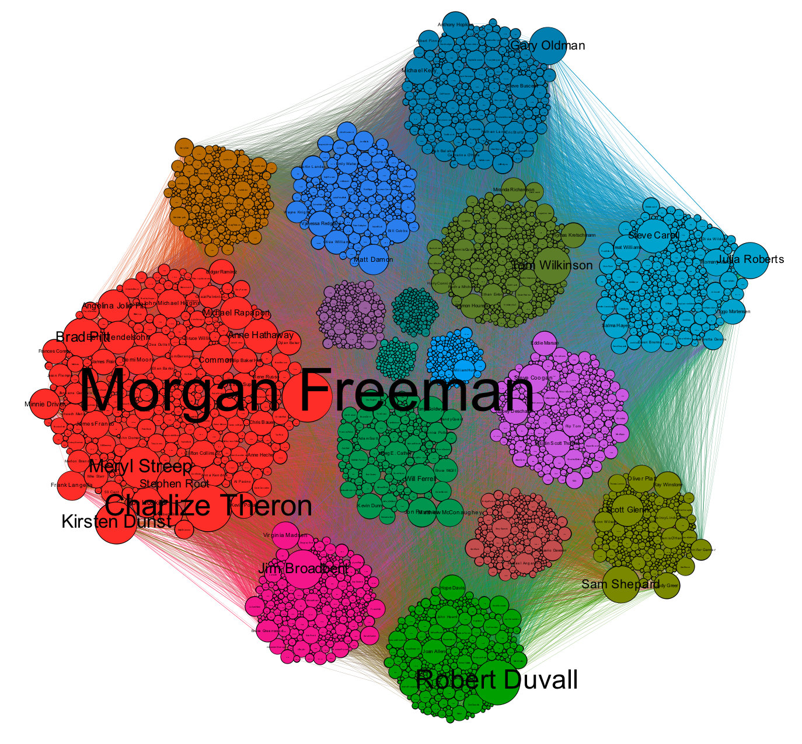

```{r}
pacman::p_load(stringr,ggplot2, tidyr, ngram, dplyr, igraph, ggraph, visNetwork, tidygraph, graphlayouts,ggpubr, ggrepel, ggridges, viridis, network, reshape, tidytext)
setwd(getwd())
options(scipen = 999)
```

```{r}
##read in data
imdb = read.csv("../data-raw/movie_metadata.csv", sep=";")
```

```{r}
colSums(sapply(imdb, is.na))
```

### Constructing the network graph

Actors will be the nodes. Edges exist only if the actors have appeared in a movie together.

```{r}
##extract the actors
actors <- imdb %>%
  select(actor_1_name, actor_2_name, actor_3_name) 
head(actors, 5)

actors <- actors %>% 
  filter(actor_1_name != "") %>% 
  filter(actor_2_name != "") %>% 
  filter(actor_3_name != "") 
```

The nodelist will only contain each actor's name once.
```{r}
##make the nodelist
actor_nodes <- actors %>% 
  gather() %>% 
  select(value) %>% 
  distinct(value)

head(actor_nodes, 5)
```
Because each movie has three top actors given, some column manipulation is needed to format the data into the two "to" and "from" columns required for the edgelist.
```{r}
##make the edgelist for actor_1 and actor_2
temp_edges_1_2 <- actors %>% 
  select(actor_1_name, actor_2_name) %>% 
  na.omit() %>% 
  dplyr::rename(from = actor_1_name, to = actor_2_name) 

temp_edges_1_2[temp_edges_1_2==""] <- NA
temp_edges_1_2[temp_edges_1_2==" "] <- NA

temp_edges_1_2 <- temp_edges_1_2 %>% 
  na.omit()

head(temp_edges_1_2, 5)
```

```{r}
## edgelist for actor_1 and actor_3
temp_edges_1_3 <- actors %>% 
  select(actor_1_name, actor_3_name) %>% 
  na.omit() %>% 
  dplyr::rename(from = actor_1_name) %>% 
  dplyr::rename(to = actor_3_name)

temp_edges_1_3[temp_edges_1_3==""] <- NA
temp_edges_1_3[temp_edges_1_3==" "] <- NA

##remove both values if there is even one NA present, eg Tom Hardy -> NA
temp_edges_1_3 <- temp_edges_1_3%>% 
  na.omit()

head(temp_edges_1_3, 5)
```

```{r}
## edgelist for actor_2 and actor_3
temp_edges_2_3 <- actors %>% 
  select(actor_2_name, actor_3_name) %>% 
  na.omit() %>% 
  dplyr::rename(from = actor_2_name) %>% 
  dplyr::rename(to = actor_3_name)

temp_edges_2_3[temp_edges_2_3==""] <- NA
temp_edges_2_3[temp_edges_2_3==" "] <- NA

temp_edges_2_3 <- temp_edges_2_3 %>% 
  na.omit()

head(temp_edges_2_3, 5)
```


```{r}
##Combine the three sets of edges
actor_edges <- data.frame(from = "", to = "")

actor_edges <- do.call("rbind", list(temp_edges_1_2, temp_edges_1_3, temp_edges_2_3))

temp_edges_1_2 = NULL
temp_edges_1_3 = NULL
temp_edges_2_3 = NULL

head(actor_edges)
```

```{r}
##create the graph
actors_in_same_movies <- graph_from_data_frame(actor_edges, directed = F)
```

Here is a simple network plot of the constructed network.
```{r echo=F }
network(actor_edges, vertex.attr = actor_nodes, matrix.type = "edgelist", ignore.eval = FALSE, directed = F) %>% 
  plot()
```
<br>
Here a densely connected 'hairball' can be seen surrounded by many small nodes that are not connected to the main component.


```{r}
##write to graphml for Gephi purposes
write.graph(actors_in_same_movies, "../data-out/graphs/actors_in_same_movies.graphml", format=c("graphml"))
```

```{r}
##Weight edges instead of duplicate edges
casted_actors <- actor_edges %>% 
  mutate(val = 1) %>% 
  select(from, to, val) %>% 
  cast_sparse(row = from, column = to, value = val)

spread_graph <- graph_from_incidence_matrix(casted_actors)
```

```{r}
projected <- bipartite.projection(spread_graph, which = "true") 
```


### Network measures

Eigenvector centrality (also called eigencentrality) is a measure of the influence of a node in a network. It assigns relative scores to all nodes in the network based on the concept that connections to high-scoring nodes contribute more to the score of the node in question than equal connections to low-scoring nodes. 
```{r}
e_values <- readRDS(file="../data-out/g_eigen_values.RDs")

projected <- projected %>% 
  set_vertex_attr(name = "g_e_values", value = e_values$values)

e_values['values'] %>% 
  as.data.frame() %>% 
  ggplot()+
  geom_density(aes(values)) +
  xlab("Eigen value") 
```
<br>
Eigen values are negatively skewed for global community 1. This means that most nodes are not connected to high scoring nodes.

In a connected graph, the normalized closeness centrality (or closeness) of a node is the average length of the shortest path between the node and all other nodes in the graph. Thus the more central a node is, the closer it is to all other nodes. (stolen from Wiki)

An actor will be well connected if other many actors can be reached in a short number of hops.
```{r warning=FALSE}
close_cent <- projected %>% 
  as_tbl_graph() %>% 
  activate(nodes) %>% 
  igraph::closeness()

var_cc <- mean(close_cent) 

projected <- projected %>% 
  set_vertex_attr(name = "g_close_cent", value = close_cent)

close_cent %>% 
  as.data.frame() %>% 
  dplyr::rename(closeness = '.') %>% 
  ggplot()+
  geom_density(aes(closeness)) +
  xlab("Centrality (Closeness)") + 
  ylab("Frequency")
```
<br>
SThe closeness distribution is very interesting. There is a high number of nodes with a relatively high and relatively low closeness. This is due to the graph having many small components and one very densely connected large component. The mean value is `r var_cc`.


Interpretively, the Boncich power measure corresponds to the notion that the power of a vertex is recursively defined by the sum of the power of its alters. The nature of the recursion involved is then controlled by the power exponent: positive values imply that vertices become more powerful as their alters become more powerful (as occurs in cooperative relations), while negative values imply that vertices become more powerful only as their alters become weaker (as occurs in competitive or antagonistic relations). (stolen from Wiki)

Essentially, the importance of an actor is defined by the importance of alters, or other connected actors.
```{r }
power_cent <- projected %>% power_centrality(exponent = 0.9)

var_pc <- max(power_cent)

projected <- projected %>% 
  set_vertex_attr(name = "g_power_cent", value = power_cent)

power_cent %>% 
  as.data.frame() %>% 
  dplyr::rename(power = '.') %>% 
  mutate(power = as.numeric(power)) %>% 
  ggplot() +
  geom_density(aes(x=power))
```
<br>
So the distribution of Boncich power is slightly positively skewed meaning that in general, vertices are considered more 'powerful' as their alters increase in power. The max power centrality is `r var_pc`.

The PageRank algorithm ignores edge weights when calculating the importance of nodes. The more likely an actor will be found when randomly searching through movies, the higher the assigned PageRank.
```{r}
page_ranks <- projected %>% 
  page_rank()

var_pr <- mean(page_ranks$vector) 

projected <- projected %>% 
  set_vertex_attr(name = "g_page_rank", value = page_ranks$vector)

page_ranks$vector %>% 
  as.data.frame() %>% 
  dplyr::rename(page_r = '.') %>% 
  mutate(page_r = as.numeric(page_r)) %>% 
  ggplot() +
  geom_density(aes(x=page_r)) +
  xlab("Page Rank")
```
<br>
Most nodes have a relatively low page rank. The mean page rank is `r var_pr`.

### Community Detection

Group Louvain optimises for modularity in the network and therefore tries to create densely connected clusters with sparse connections between the clusters.
```{r}
node_comms <- as_tbl_graph(projected) %>% 
  activate(nodes) %>% 
  mutate(global_comm = group_louvain(weights = weight)) %>% 
  as.data.frame()

projected <- projected %>% 
  set_vertex_attr("comm", value = node_comms$global_comm)
```

```{r include=F}
node_comms <- node_comms[-1,]
```

#### Distribution of community size

```{r}
node_comms <- projected %>%
  as_tbl_graph() %>% 
  as.data.frame()

node_comms %>% 
  ggplot() +
  geom_bar(aes(x=comm))+
  scale_y_log10()+
  NULL
```
<br>
This graph shows the distribution of community size. The community size is exponentially distributed, resulting in a few large communities and many smaller ones. Some form of filtering on community size is needed to remove the smaller communities.

```{r}
node_comms %>% 
  filter(comm < 55) %>% 
  ggplot() +
  geom_bar(aes(x=comm))+
  geom_vline(xintercept=c(17.5), linetype="dotted")+
  NULL
```
<br>
After removing communities smaller than 100 actors, only 17 communities remain.

```{r}
node_comms_filtered <- node_comms %>% 
  filter(comm <= 53) 

projected <- set_vertex_attr(projected, name = "Label", value = projected$name)
```

#### Visualising the network

The 17 remaining communities were analysed in gephi. The nodes are coloured and grouped by community, while the size of the node and text are dependent on the degree of the node.

```{r echo=FALSE, out.width="100" }

```
<br>
It is clear that the remaining communities are very densely connected meaning that even after optimising for modularity, actors have many connections outside their community. These dense connections may have negatively impacted the results of the Group Louvain and there is concern as to the true modularity of these communities.


```{r message=FALSE, warning=FALSE}
top_comms_nodes <- node_comms %>% 
  add_count(comm) %>%
  arrange(name, desc(n)) %>% 
  group_by(comm) %>% 
  distinct %>% 
  top_n(5) %>% 
  ungroup() %>% 
  arrange(n) %>% 
  filter(n > 100) %>% 
  arrange(desc(n)) %>% 
  na.omit()
top_comms_nodes
```

```{r warning=FALSE}
filtered_actor_edges <- subgraph(projected, top_comms_nodes$name)
```

#### Analysis of Global Comm 1

```{r warning=FALSE}
g_comm_1_nodes <-  top_comms_nodes %>% 
  filter(comm == 1) 
g_comm_1_graph <- subgraph(projected, g_comm_1_nodes$name) 
```

```{r}
e_values_1 <- g_comm_1_graph %>% 
  as_adjacency_matrix(type="both") %>% 
  eigen()


g_comm_1_graph <- g_comm_1_graph %>% 
  set_vertex_attr(name = "local_e_values", value = e_values_1$values)

e_values_1['values'] %>% 
  as.data.frame() %>% 
  ggplot()+
  geom_density(aes(values)) +
  xlab("Eigen value")
```
<br>
Eigen values are negatively skewed for global community 1. This means that most nodes are not connected to high scoring nodes.

```{r}
close_cent <- g_comm_1_graph %>% 
  closeness()

var <- mean(close_cent)

g_comm_1_graph <- g_comm_1_graph %>% 
  set_vertex_attr(name = "local_close_cent", value = close_cent)

close_cent %>% 
  as.data.frame() %>% 
  dplyr::rename(closeness = '.') %>% 
  ggplot()+
  geom_density(aes(closeness)) +
  xlab("Closeness centrality")
```
<br>
The average closeness centrality is `r var`. When looking at a single community we expect a higher average closeness than when calculating for the whole graph which was `r var_cc`.


```{r}
power_cent <- g_comm_1_graph %>% power_centrality(exponent = 0.9)

var <- max(power_cent) 

g_comm_1_graph <- g_comm_1_graph %>% 
  set_vertex_attr(name = "local_power_cent", value = power_cent)

power_cent %>% 
  as.data.frame() %>% 
  dplyr::rename(power = '.') %>% 
  mutate(power = as.numeric(power)) %>% 
  ggplot() +
  geom_density(aes(x=power))
```
<br>
The average Boncich power centrality is `r var`.

```{r warning=TRUE}
page_ranks <- g_comm_1_graph %>% 
  page_rank()

var <- mean(page_ranks$vector)

g_comm_1_graph <- g_comm_1_graph %>% 
  set_vertex_attr(name = "local_page_rank", value = page_ranks$vector)

page_ranks$vector %>% 
  as.data.frame() %>% 
  dplyr::rename(page_r = '.') %>% 
  mutate(page_r = as.numeric(page_r)) %>% 
  ggplot() +
  geom_density(aes(x=page_r)) +
  xlab("Page Rank")
```
<br>
The local mean page rank is `r var`, compared to the global mean of `r var_pr`.

Creating the graph of centrality measures for community 1.
```{r}
attributes <- vertex_attr(g_comm_1_graph)

g_comm_1_nodes <-  data.frame(name = attributes['name'], comm = attributes['comm'], g_e_values=attributes['g_e_values'], g_close_cent=attributes['g_close_cent'], g_page_rank = attributes['g_page_rank'], g_power_cent = attributes['g_power_cent'], local_e_values  = attributes['local_e_values'], local_page_rank = attributes['local_page_rank'], local_close_cent = attributes['local_power_cent'], local_close_cent = attributes['local_close_cent'], stringsAsFactors=FALSE)
```


#### Analysis of Global Comm 2

This is the creation of the subgraph that will only contain vertices listed in community 2.
```{r warning=FALSE}
g_comm_2_nodes <-  top_comms_nodes %>% 
  filter(comm == 2) 
g_comm_2_graph <- subgraph(projected, g_comm_2_nodes$name) 
```

```{r}
e_values_2 <- g_comm_2_graph %>% 
  as_adjacency_matrix(type="both") %>% 
  eigen()


g_comm_2_graph <- g_comm_2_graph %>% 
  set_vertex_attr(name = "local_e_values", value = e_values_2$values)

e_values_2['values'] %>% 
  as.data.frame() %>% 
  ggplot()+
  geom_density(aes(values)) +
  xlab("Eigen value")
```
<br>
Eigen values are skewed to the right for global community 2. This means that most nodes are not connected to high scoring nodes.

```{r}
##Comm Centrality
##Closeness
close_cent <- g_comm_2_graph %>% 
  closeness()

var <- mean(close_cent)

g_comm_2_graph <- g_comm_2_graph %>% 
  set_vertex_attr(name = "local_close_cent", value = close_cent)

close_cent %>% 
  as.data.frame() %>% 
  dplyr::rename(closeness = '.') %>% 
  ggplot()+
  geom_density(aes(closeness)) +
  xlab("Closeness centrality")
```
<br>
The mean closeness centrality is `r var`.
```{r}
power_cent <- g_comm_2_graph %>% power_centrality(exponent = 0.9)

var <- mean(power_cent)

g_comm_2_graph <- g_comm_2_graph %>% 
  set_vertex_attr(name = "local_power_cent", value = power_cent)

power_cent %>% 
  as.data.frame() %>% 
  dplyr::rename(power = '.') %>% 
  mutate(power = as.numeric(power)) %>% 
  ggplot() +
  geom_density(aes(x=power))
```
<br>
The mean Boncich power centrality is `r var`.


```{r}
##Page Rank
page_ranks <- g_comm_2_graph %>% 
  page_rank()

var <- mean(page_ranks$vector)

g_comm_2_graph <- g_comm_2_graph %>% 
  set_vertex_attr(name = "local_page_rank", value = page_ranks$vector)

page_ranks$vector %>% 
  as.data.frame() %>% 
  dplyr::rename(page_r = '.') %>% 
  mutate(page_r = as.numeric(page_r)) %>% 
  ggplot() +
  geom_density(aes(x=page_r)) +
  xlab("Page Rank")
```
<br>
The mean page rank for community 2 is `r var`.

Creating the graph of centrality measures for community 2.
```{r}
attributes <- vertex_attr(g_comm_2_graph)

g_comm_2_nodes <-  data.frame(name = attributes['name'], comm = attributes['comm'], g_e_values=attributes['g_e_values'], g_close_cent=attributes['g_close_cent'], g_page_rank = attributes['g_page_rank'], g_power_cent = attributes['g_power_cent'], local_e_values  = attributes['local_e_values'], local_page_rank = attributes['local_page_rank'], local_close_cent = attributes['local_power_cent'], local_close_cent = attributes['local_close_cent'], stringsAsFactors=FALSE)
```


#### Analysis of Global Comm 3

This is the creation of the subgraph that will only contain vertices listed in community 3.
```{r warning=FALSE}
g_comm_3_nodes <-  top_comms_nodes %>% 
  filter(comm == 3) 
g_comm_3_graph <- subgraph(projected, g_comm_3_nodes$name) 
```

```{r }
e_values_3 <- g_comm_3_graph %>% 
  as_adjacency_matrix(type="both") %>% 
  eigen()


g_comm_3_graph <- g_comm_3_graph %>% 
  set_vertex_attr(name = "local_e_values", value = e_values_3$values)

e_values_3['values'] %>% 
  as.data.frame() %>% 
  ggplot()+
  geom_density(aes(values)) +
  xlab("Eigen value")
```
<br>
Eigen values are skewed to the right for global community 3. This means that most nodes are not connected to high scoring nodes.

```{r}
close_cent <- g_comm_3_graph %>% 
  closeness()

var <- mean(close_cent)

g_comm_3_graph <- g_comm_3_graph %>% 
  set_vertex_attr(name = "local_close_cent", value = close_cent)

close_cent %>% 
  as.data.frame() %>% 
  dplyr::rename(closeness = '.') %>% 
  ggplot()+
  geom_density(aes(closeness)) +
  xlab("Closeness centrality")
```
<br>
The mean closeness centrality is `r var`.


```{r}
power_cent <- g_comm_3_graph %>% power_centrality(exponent = 0.9)

var <- mean(power_cent)

g_comm_3_graph <- g_comm_3_graph %>% 
  set_vertex_attr(name = "local_power_cent", value = power_cent)

power_cent %>% 
  as.data.frame() %>% 
  dplyr::rename(power = '.') %>% 
  mutate(power = as.numeric(power)) %>% 
  ggplot() +
  geom_density(aes(x=power))
```
<br>
The mean Boncich power centrality in community 3 is `r var`.

```{r}
page_ranks <- g_comm_3_graph %>% 
  page_rank()

var <- mean(page_ranks$vector)

g_comm_3_graph <- g_comm_3_graph %>% 
  set_vertex_attr(name = "local_page_rank", value = page_ranks$vector)

page_ranks$vector %>% 
  as.data.frame() %>% 
  dplyr::rename(page_r = '.') %>% 
  mutate(page_r = as.numeric(page_r)) %>% 
  ggplot() +
  geom_density(aes(x=page_r)) +
  xlab("Page Rank")
```
<br>
The mean page rank is `r var`.

Creating the graph of centrality measures for community 3.
```{r}
attributes <- vertex_attr(g_comm_3_graph)

g_comm_3_nodes <-  data.frame(name = attributes['name'], comm = attributes['comm'], g_e_values=attributes['g_e_values'], g_close_cent=attributes['g_close_cent'], g_page_rank = attributes['g_page_rank'], g_power_cent = attributes['g_power_cent'], local_e_values  = attributes['local_e_values'], local_page_rank = attributes['local_page_rank'], local_close_cent = attributes['local_power_cent'], local_close_cent = attributes['local_close_cent'], stringsAsFactors=FALSE)
```


### Highlighting nodes using different menasures of importance.

The top nodes from selected communities will be compared to see which measure is the best indicator of higher ratings. 

##### Overall measures

###### Highest degree
```{r echo=FALSE}
V(projected)$name[degree(projected)==max(degree(projected))]
```
Morgan Freeman has the highest degree of any node in th graph and could therefore be seen as an influential node, however he may not be a central one. Morgan Freeman has acted with the greatest number of distinct actors according to the movies in this dataset.

###### Closeness centrality
```{r echo=FALSE}
print(paste0("Highest global closeness centrality: ", node_comms_filtered[which.max(node_comms_filtered$g_close_cent),]$name))
```
Due to the high degree, it is not surprising that Morgan Freeman has the highest level of closeness centrality across the graph.


###### Highest Page Ranking
```{r echo=FALSE}
print(paste0("Highest global Page rank: ", node_comms_filtered[which.max(node_comms_filtered$g_page_rank),]$name))
```
Morgan Freeman is considered the most important node by the PageRank algorithm

###### Highest Boncich Power centrality
```{r echo=FALSE}
print(paste0("Highest global Boncich power centrality: ", node_comms_filtered[which.max(node_comms_filtered$g_power_cent),]$name))
```
This actor himself is not considered the most influential however he has the most influential connections.


##### Community 1
```{r echo=FALSE, out.width="100" }
knitr::include_graphics("../data-out/pretty_pics/g_comm_1.png")
```

###### Highest degree
```{r echo=FALSE}
V(g_comm_1_graph)$name[degree(g_comm_1_graph)==max(degree(g_comm_1_graph))]
```

###### Closeness centrality
```{r echo=FALSE}
print(paste0("Highest global closeness centrality: ", g_comm_1_nodes[which.max(g_comm_1_nodes$g_close_cent),]$name))
print(paste0("Highest local closeness centrality: ", g_comm_1_nodes[which.max(g_comm_1_nodes$local_close_cent),]$name))
```

###### Highest Page Ranking
```{r echo=FALSE}
print(paste0("Highest global page rank: ", g_comm_1_nodes[which.max(g_comm_1_nodes$g_page_rank),]$name))
print(paste0("Highest local page rank: ", g_comm_1_nodes[which.max(g_comm_1_nodes$local_page_rank),]$name))
```

###### Highest Boncich Power centrality
```{r echo=FALSE}
print(paste0("Highest global power centrality: ", g_comm_1_nodes[which.max(g_comm_1_nodes$g_power_cent),]$name))
print(paste0("Highest local power centrality: ", g_comm_1_nodes[which.max(g_comm_1_nodes$local_power_cent),]$name))
```


##### Community 2

```{r echo=FALSE, out.width="100"}
knitr::include_graphics("../data-out/pretty_pics/g_comm_2.png")
```

###### Highest degree
```{r}
V(g_comm_2_graph)$name[degree(g_comm_2_graph)==max(degree(g_comm_2_graph))]
```

###### Closeness centrality
```{r echo=FALSE}
print(paste0("Highest global closeness centrality: ", g_comm_2_nodes[which.max(g_comm_2_nodes$g_close_cent),]$name))
print(paste0("Highest global closeness centrality: ", g_comm_2_nodes[which.max(g_comm_2_nodes$local_close_cent),]$name))
```

###### Highest Page Ranking
```{r echo=FALSE}
print(paste0("Highest global Page rank: ", g_comm_2_nodes[which.max(g_comm_2_nodes$g_page_rank),]$name))
print(paste0("Highest local Page rank: ", g_comm_2_nodes[which.max(g_comm_2_nodes$local_page_rank),]$name))
```

###### Highest Boncich Power centrality
```{r echo=FALSE}
print(paste0("Highest global Boncich power centrality: ", g_comm_2_nodes[which.max(g_comm_2_nodes$g_power_cent),]$name))
print(paste0("Highest local Boncich power centrality: ", g_comm_2_nodes[which.max(g_comm_2_nodes$local_power_cent),]$name))
```
The actors Gary Coleman and Pamela Anderson have the highest global and local Boncich power centrality, respectively. This means that across the whole graph (but limited to vertices in community 2), Gary Coleman has the most powerful connections while Pamela Anderson has the highest number of powerful connections within community 2.


##### Community 3

```{r echo=FALSE, out.width="100"}
knitr::include_graphics("../data-out/pretty_pics/g_comm_3.png")
```

###### Highest degree
```{r echo=FALSE}
V(g_comm_3_graph)$name[degree(g_comm_3_graph)==max(degree(g_comm_3_graph))]
```

###### Closeness centrality
```{r echo=FALSE}
print(paste0("Highest global closeness centrality: ", g_comm_3_nodes[which.max(g_comm_3_nodes$g_close_cent),]$name))
print(paste0("Highest local closeness centrality: ", g_comm_3_nodes[which.max(g_comm_3_nodes$local_close_cent),]$name))
```

###### Highest Page Ranking
```{r echo=FALSE}
print(paste0("Highest global Page rank: ", g_comm_3_nodes[which.max(g_comm_3_nodes$g_page_rank),]$name))
print(paste0("Highest local Page rank: ", g_comm_3_nodes[which.max(g_comm_3_nodes$local_page_rank),]$name))
```

###### Highest Boncich Power centrality
```{r echo=FALSE}
print(paste0("Highest global Boncich power centrality: ", g_comm_3_nodes[which.max(g_comm_3_nodes$g_power_cent),]$name))
print(paste0("Highest local Boncich power centrality: ", g_comm_3_nodes[which.max(g_comm_3_nodes$local_power_cent),]$name))
```
The actors Tabu and Charlize Theron have the highest global and local Boncich power centrality, respectively. This means that across the whole graph (but limited to vertices in community 3), Tabu has the most powerful connections while Charlize Theron has the highest number of powerful connections within community 3.


### Analysis of centrality measures and ratings

Here the average rating of movies starred in for each actor is calculated.
```{r warning=FALSE}
average_imdb_actor_ratings <- imdb %>% 
  select(imdb_score, actor_1_name) %>% 
  dplyr::rename(actor = actor_1_name) %>% 
  group_by(actor) %>% 
  mutate(avg_rating = mean(imdb_score)) %>% 
  select(-imdb_score) %>% 
  distinct(actor, .keep_all = T) %>% 
  na.omit()

temp2 <- imdb %>% 
  select(imdb_score, actor_2_name) %>% 
  dplyr::rename(actor = actor_2_name) %>% 
  group_by(actor) %>% 
  mutate(avg_rating = mean(imdb_score)) %>% 
  select(-imdb_score) %>% 
  distinct(actor, .keep_all = T) %>% 
  na.omit()

temp3 <- imdb %>% 
  select(imdb_score, actor_3_name) %>% 
  dplyr::rename(actor = actor_3_name) %>% 
  group_by(actor) %>% 
  mutate(avg_rating = mean(imdb_score)) %>% 
  select(-imdb_score) %>% 
  distinct(actor, .keep_all = T) %>% 
  na.omit()

average_imdb_actor_ratings <- full_join(average_imdb_actor_ratings, temp2) %>% 
  group_by(actor) %>% 
  summarise(avg_rating = mean(avg_rating)) 

average_imdb_actor_ratings <- full_join(average_imdb_actor_ratings, temp3) %>% 
  group_by(actor) %>% 
  summarise(avg_rating = mean(avg_rating)) 


average_imdb_actor_ratings <- average_imdb_actor_ratings[-1,]
```

#### Overall 
```{r}
average_imdb_actor_ratings %>% 
  filter(actor == 'Morgan Freeman')                    
```
<br>
Morgan Freeman has an average movie rating of 7.7605. In terms of the overall graph, this actor has the highest degree, closeness centrality and page rank.

```{r}
average_imdb_actor_ratings %>% 
  filter(actor == 'Matt Keeslar')                    
```
<br>
Matt Keeslar has an average movie rating of 7. In terms of the overall graph, this actor has the highest Boncich centrality meaning he has very influential alters.

##### Community 1
```{r}
average_imdb_actor_ratings %>% 
  filter(actor == 'Tom Wilkinson')                    
```
<br>
Tom Wilkinson has an average movie rating of 7.077083. In terms of community 1, this actor has the highest degree, global closeness centrality and global as well as local page rank.

```{r}
average_imdb_actor_ratings %>% 
  filter(actor == 'Miranda Richardson')                    
```
<br>
Miranda Richardson has an average movie rating of 6.855. In terms of community 1, this actor has the highest local closeness centrality meaning she is very central within community 1 but not overall in the graph.

```{r}
average_imdb_actor_ratings %>% 
  filter(actor == 'R. Marcos Taylor')                    
```
<br>
R. Marcos Taylor has an average movie rating of 7.9. In terms of community 1, this actor has the highest global Boncich centrality meaning that across the graph he has influential alters.

```{r}
average_imdb_actor_ratings %>% 
  filter(actor == 'Eric Sykes')                    
```
<br>
Eric Sykes has an average movie rating of 7.6. In terms of community 1, this actor has the highest local Boncich centrality meaning that if only looking at community 1, Eric Sykes has the most influential alters.


##### Community 2
```{r}
average_imdb_actor_ratings %>% 
  filter(actor == 'Scarlett Johansson')                    
```
<br>
Scarlett Johansson has an average movie rating of 7.522159. In terms of community 2, this actor has the highest degree.

```{r}
average_imdb_actor_ratings %>% 
  filter(actor == 'Kristin Scott Thomas')                    
```
<br>
Kristin Scott Thomas has an average movie rating of 6.939583. In terms of community 2, this actor has the highest global closeness centrality meaning she is very central overall in the graph but not the most central if only looking at community 2.

```{r}
average_imdb_actor_ratings %>% 
  filter(actor == 'Rachael Harris')                    
```
<br>
Rachael Harris has an average movie rating of 6.208333. In terms of community 2, this actor has the highest local closeness centrality meaning she is very central within community 2 but not overall in the graph.

```{r}
average_imdb_actor_ratings %>% 
  filter(actor == 'Steve Coogan')                    
```
<br>
Steve Coogan has an average movie rating of 6.2875. In terms of community 2, this actor has the highest global page rank.

```{r}
average_imdb_actor_ratings %>% 
  filter(actor == 'Richard Schiff')                    
```
<br>
Richard Schiff has an average movie rating of 6.143333. In terms of community 2, this actor has the highest local page rank.

```{r}
average_imdb_actor_ratings %>% 
  filter(actor == 'Gary Coleman')                    
```
<br>
Gary Coleman has an average movie rating of 6.15. In terms of community 2, this actor has the highest global Boncich centrality and has influential alters across the network.

```{r}
average_imdb_actor_ratings %>% 
  filter(actor == 'Pamela Anderson')                    
```
<br>
Pamela Anderson has an average movie rating of 5.5. In terms of community 2, this actor has the highest local Boncich centrality and has influential alters within community 2.

#####Community 3
```{r}
average_imdb_actor_ratings %>% 
  filter(actor == 'Morgan Freeman')                    
```
<br>
Morgan Freeman has an average movie rating of 7.7605. In terms of community 3, this actor has the highest degree, closeness centrality and page rank in terms of both local and global calculations.

```{r}
average_imdb_actor_ratings %>% 
  filter(actor == 'Tabu')                    
```
<br>
Tabu acts primarily in Hindi films and is the only actor highlighted not from Western films. The average movie rating is 7.8 and in terms of community 3, Tabu has the highest global Boncich centrality.

```{r}
average_imdb_actor_ratings %>% 
  filter(actor == 'Charlize Theron')                    
```
<br>
Charlize Theron has an average movie rating of 6.586667 and has the highest local Boncich power centrality within community 3.

##### Centrality measures and ratings
```{r warning=FALSE}
ratings_and_centrality <- average_imdb_actor_ratings %>% 
  dplyr::rename(name = actor) %>% 
  left_join(g_comm_1_nodes) %>% 
  left_join(g_comm_2_nodes) %>% 
  left_join(g_comm_3_nodes) %>% 
  na.omit()
```

```{r}
ratings_and_centrality %>% 
  ggplot() +
  geom_smooth(aes(x = g_e_values, y = avg_rating), method = 'loess') +
  xlab("Global Eigen values") +
  ylab("Avg movie rating") +
  ggtitle("Global Eigen values vs Average Movie rating")
```
```{r}
ratings_and_centrality %>% 
  ggplot() +
  geom_smooth(aes(x = g_close_cent, y = avg_rating), method = 'loess') +
  xlab("Global Closeness centrality values") +
  ylab("Avg movie rating") +
  ggtitle("Global Closeness Centrality vs Average Movie rating")
```
```{r}
ratings_and_centrality %>% 
  ggplot() +
  geom_smooth(aes(x = g_page_rank, y = avg_rating), method = 'loess') +
  xlab("Global Page Rank values") +
  ylab("Avg movie rating") +
  ggtitle("Global Page Rank vs Average Movie rating")
```
```{r}
ratings_and_centrality %>% 
  ggplot() +
  geom_smooth(aes(x = g_power_cent, y = avg_rating), method = 'loess') +
  xlab("Global Power Centrality") +
  ylab("Avg movie rating") +
  ggtitle("Global Boncich Power Centrality vs Average Movie rating")
```
<br>
None of the graphs show any strong correlation between the global centrality and the average rating of the movie. It will now be explored whether using local centrality measures will produce a different outcome.


```{r}
ratings_and_centrality %>% 
  ggplot() +
  geom_smooth(aes(x = local_e_values, y = avg_rating), method = 'loess') +
  xlab("Eigen vector Centrality") +
  ylab("Avg movie rating") +
  ggtitle("Local Eigen vector Centrality vs Average Movie rating")
```
```{r}
ratings_and_centrality %>% 
  ggplot() +
  geom_smooth(aes(x = local_close_cent, y = avg_rating), method = 'loess') +
  xlab("Closeness Centrality") +
  ylab("Avg movie rating") +
  ggtitle("Local Closeness Centrality vs Average Movie rating")
```
```{r}
ratings_and_centrality %>% 
  ggplot() +
  geom_smooth(aes(x = local_page_rank, y = avg_rating), method = 'loess') +
  xlab("Page rank") +
  ylab("Avg movie rating") +
  ggtitle("Local Page rank vs Average Movie rating")
```
```{r}
ratings_and_centrality %>% 
  ggplot() +
  geom_smooth(aes(x = local_power_cent, y = avg_rating), method = 'loess') +
  xlab("Power Centrality") +
  ylab("Avg movie rating") +
  ggtitle("Local Boncich Power Centrality vs Average Movie rating")
```
<br>
The local centralities do not appear to have any correlation to the average movie rating. 

### Concluding remarks

It can be said that the centrality of nodes is not an idicator of success for movie ratings. The variance in movie ratings is relatively high for very central nodes as well as not as central nodes.

